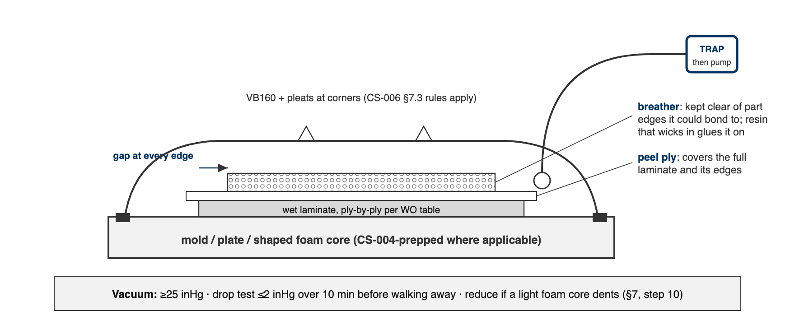

# CS-007 Wet Layup & Vacuum Bagging

| | |
|---|---|
| **Doc ID** | CS-007 |
| **Title** | Wet Layup & Vacuum Bagging |
| **Revision** | C |
| **Status** | Draft, pending Lead signature (photos to add at first SN6 use) |
| **Effective date** | 2026-08-28 |
| **Supersedes** | Verbal wet-layup training |

**Approvals**

| Role | Name | Date |
|---|---|---|
| Author | Simon Starbuck (drafted with Claude, SN6 Resources) | 2026-07-12 |
| Reviewer | simon (reviewer agent) | |
| Approver (Composites Lead) | | |

**Revision history**

| Rev | Date | Author | Description of change |
|---|---|---|---|
| A | 2026-07-12 | Claude | Initial outline |
| B | 2026-07-28 | Claude | Language pass: fewer em dashes for rhythm variety, no content change. |
| C | 2026-08-28 | Claude | Out of outline, engineering pass (CS-000 Rev C conventions). §7's ten numbered lines became a procedure with subsections; every number in it was already in Rev B or its references, so nothing was invented, only unpacked. §4 definitions written out. Figure 1 draws the bag stack with the breather clearance rule, the one that turns a bagged part into a bagged part glued to its breather. Photo placeholders stay until the first SN6 wet layup. |

---

## 1. Purpose

Wet layup is our second core process (seat, flat panels, foam-wrapped wing elements). In SN5 the knowledge was verbal plus one Slack SOP; this doc writes it down with the numbers attached.

## 2. Scope

Hand lamination with West System 105, vacuum-bagged, on molds (CS-004-prepped), flat plates, and foam cores (foam-wrapped wing elements). Infusion: CS-006.

## 3. References

| Ref | Document | Where |
|---|---|---|
| R1 | West 105/206 TDS (5:1 by volume; pot life 20–25 min @72 °F; thin-film cure 10–15 h) | `04 Datasheets/WEST_SYSTEM_105_Epoxy_Resin_with_206_Slow_Hardener.pdf` |
| R2 | West 105/205 TDS (fast: pot life 9–12 min) | `04 Datasheets/WestSystems-105-205-Epoxy-Resin.pdf` |
| R3 | VB160 film, PP180 peel ply, breather | `04 Datasheets/` |
| R4 | CS-002 (stack), CS-004 (mold prep), CS-008 (mixing/exotherm) | this series |
| R5 | Simon's layup SOP (Slack, 2026-05-30): 105 "big tank, blue label" + 206 "large metal can, red label", 5:1 | Slack record |

## 4. Definitions

- **Wet-out**: cloth fully saturated by resin: uniform sheen, weave still visible. Swimming in resin is past wet-out, not better.
- **Breather**: lofted bleed cloth between peel ply and bag. It gives air a path to the vacuum port and absorbs excess resin. It is kept clear of part edges it could bond to; resin that wicks into breather at an edge glues it on.
- **Bridging**: bag film spanning a corner instead of following it. Under vacuum a bridge either punctures or leaves a resin-rich void at the corner. Pleats exist to prevent it.
- **60:40**: target cured fiber:resin ratio **by weight**. The mix factor in §7.2 deliberately overshoots it; squeegee and breather carry the excess out.

## 5. Equipment & Materials

West 105 + 206 (default) or 205 (small parts), calibrated pumps (5:1 by volume, R1) or scale (weight ratios in R1: 5.36:1 for 206), brushes/rollers/squeegees, peel ply, breather, VB160, tacky tape, vacuum pump + trap + gauge.

## 6. Safety

Per West SDS + team rules: nitrile gloves (sensitizer; same warning as CS-004 §6), ventilation, no solvent on skin; exotherm rules per CS-008 (105/205 in a pot gets hot fast). Respirator with A-filter for large overhead/enclosed laminating.

## 7. Procedure

### 7.1 Prerequisites

1. Stack frozen and printed on the WO (CS-002 §7.2). Mold sealed and released per CS-004 with its quality checks passed, or plate waxed, or foam core shaped and dry-fitted.
2. Cloth cut per the WO ply table; total dry fiber mass weighed and recorded on the WO.
3. All consumables (peel ply, breather, bag, tacky tape) cut to size before any resin is mixed. Pot life spent hunting scissors is pot life lost.

### 7.2 Resin math and mixing

1. Mix mass ≈ **dry fiber mass × 0.9**. That is deliberately more than the 60:40 cured target implies: the squeegee and the breather take the excess out, and the *cured part* lands near 60:40. Record mixed and final masses on the WO to tune this factor.
2. Mix per CS-008 discipline. With the calibrated pumps, **5:1 by volume, one FULL stroke of each pump per shot, never partial strokes** (R1). By scale: 5.36:1 for 206, 5.19:1 for 205 (CS-008 §5).
3. Pot life budget, 206 at 72 °F: **20–25 min per 100 g pot** (R1). 205 halves that (R2). Bigger jobs mix several small pots rather than one large one; a pot that warms is a pot that is about to gel (CS-008 §6).

### 7.3 Wet-out

1. Wet out ply-by-ply per the WO ply table: resin on, then squeegee each ply until **shiny-wet with the weave visible**, not swimming. Chase dry (white) patches before the next ply goes on; you will not see them again.
2. Tick each ply as laid on the WO; note any substitution or extra ply (CS-002 §7.4).

[PHOTO: correctly wetted ply: uniform sheen, weave visible, no pooling]

### 7.4 Bag

1. Peel ply over the full laminate, past its edges.
2. Breather over the peel ply, held back from every part edge it could bond to (Figure 1).
3. Bag with VB160 and tacky tape, pleats at corners and every 300–400 mm of curved perimeter; CS-006 §7.3 rules apply, including the trap between bag and pump.

### 7.5 Vacuum and drop test

1. Pull to **≥25 inHg**.
2. Drop test before walking away: isolate the pump; the bag shall lose **≤2 inHg over 10 minutes**. Record start and end readings on the WO. Leak hunting per CS-006 §7.7.
3. On light foam cores, watch for vacuum crush: if the core dents, reduce vacuum and record the level that held on the WO, per part, so the next build starts from a number.

[PHOTO: bagged wet layup under vacuum, pleats visible, gauge in frame]

### 7.6 Cure and demold

1. Leave bagged under vacuum overnight minimum. 206 reaches thin-film solid in **10–15 h at 72 °F** (R1); a cold shop runs longer.
2. Demold no earlier than the **FEB hold** for the system (CS-008 §5; the WO enforces it). Record times and masses on the WO; label the part per CS-001; hand to CS-009 for trim.

### 7.7 Foam-wrapped elements (RW E2–E5 class)

The same flow over a shaped foam core instead of a mold: wet plies wrap the core, then peel ply, breather, bag. The §7.5 crush rule is the one that bites here; everything else is unchanged.

## 8. Quality checks / acceptance criteria

| Check | Target | Method | Record where |
|---|---|---|---|
| Vacuum | ≥25 inHg; drop ≤2 inHg/10 min | Gauge | WO |
| Wet-out | No white/dry weave visible | Visual per ply | WO |
| Mass | WO target ±10% | Scale | WO qualityChecks |

## 9. Records

Same as CS-006 §9: times, masses, gauge readings, photos into the WO.
