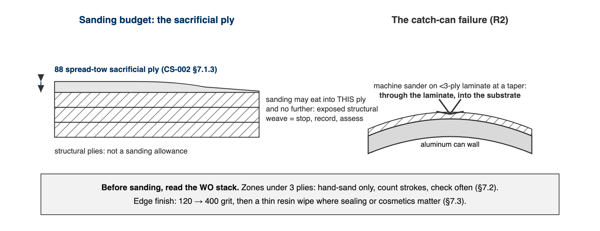

# CS-009 Trimming, Sanding & Finishing

| | |
|---|---|
| **Doc ID** | CS-009 |
| **Title** | Trimming, Sanding & Finishing of Cured Composites |
| **Revision** | C |
| **Status** | Draft, pending Lead signature (photos to add at first SN6 use) |
| **Effective date** | 2026-08-28 |
| **Supersedes** | Verbal Dremel training |

**Approvals**

| Role | Name | Date |
|---|---|---|
| Author | Simon Starbuck (drafted with Claude, SN6 Resources) | 2026-07-12 |
| Reviewer | simon (reviewer agent) | |
| Approver (Composites Lead) | | |

**Revision history**

| Rev | Date | Author | Description of change |
|---|---|---|---|
| A | 2026-07-12 | Claude | Initial outline |
| B | 2026-07-28 | Claude | Language pass: fewer em dashes for rhythm variety, no content change. |
| C | 2026-08-28 | Claude | Out of outline, engineering pass (CS-000 Rev C conventions). §7's six numbered lines became subsections; §4 and §5 written out as definitions and an equipment table. Every number was already in Rev B or its references. Figure 1 draws the sanding budget (the sacrificial ply) beside the thin-laminate failure that killed the catch cans, which is the whole argument of §7.2 in one image. |

---

## 1. Purpose

Cutting and sanding cured CF is where we make our dust (health problem), our edges (quality problem), and, in SN5, some of our damage: we punctured catch cans sanding thin laminate (2026-05-27), and Dremel work on molds ate heads and marred surfaces. These are the rules for cutting, sanding, and coating cured parts.

## 2. Scope

Cured CF/glass parts: trimming to scribe lines, edge finishing, surface prep for bonding, clear-coating. Waterjet/CNC cutting of flat panels included at outline level.

## 3. References

| Ref | Document | Where |
|---|---|---|
| R1 | DP420 TDS (structural bonding prep) | `04 Datasheets/3m-scotch-weld-epoxy-adhesive-dp420-black.pdf` |
| R2 | Catch-can puncture incident | FEB-COMP-PP-001 §PP-05 / minors |
| R3 | CS-002 (sacrificial ply concept), CS-010 (don't sand chasing conductivity) | this series |

## 4. Definitions

- **Sacrificial ply**: the 88 spread-tow outer layer specified in the stack (CS-002 §7.1.3) to absorb sanding. It is the sanding budget; structural plies are not.
- **Trim line**: the part's cut boundary, transferred from the mold's scribe lines at demold.
- **Keying**: abrading a bond face so adhesive has something to grip. 120-grit for DP420 (R1).

## 5. Equipment & Materials

| Item | Spec / product | Notes |
|---|---|---|
| Rotary tool + wheels | Dremel, reinforced cut-off wheels | Plain wheels shatter in CF; reinforced only |
| Dust extraction | Shop extractor at the cut | Runs for every cut and every sand of cured laminate (§6) |
| Sandpaper | 120 → 400 → 800+ | 120 for trim and keying, 400 for edges, 800+ for pre-clear-coat |
| Waterjet | Jacobs, DXF through the WO | Flat panels (§7.5) |
| Clear coat | Acrylic Urethane A/B (Lime Line, in stock) | §7.4; encapsulates the part label (CS-001 §7.5) |
| Structural adhesive | 3M DP420 | R1: 2:1, 20 min work life, handling 2 h, full cure 24 h @72 °F |

## 6. Safety

- **CF dust is the team's worst routine exposure:** respirator (P100/dust) + dust extraction ON for any cutting/sanding of cured laminate; long sleeves; gloves (cut CF edges splinter).
- **Supervision rule (SN5, stands until the lead changes it): no cutting cured carbon without a second trained person present.**
- Waterjet per Jacobs shop rules.

## 7. Procedure

### 7.1 Trim

1. Trim no earlier than the FEB hold for the resin system (CS-008 §5); the WO's demould step gates this.
2. Mark the cut from the scribe-transferred trim line. Tape the cut path: the tape controls chips and shows the line under dust.
3. Cut with the extractor running and a second trained person present (§6). Cut outside the line and sand to it; a Dremel does not steer well enough to cut on it.

### 7.2 Sand

1. **Read the WO stack before sanding anything.** The sanding budget is the sacrificial ply and only the sacrificial ply (Figure 1). Exposed structural weave past the plan: stop, record it, assess against the WO qualityChecks.
2. Zones under 3 plies: **hand-sand only, count strokes, check often.** Machine-sanding thin laminate is how the catch cans died (R2).

3. Edges: 120 → 400 grit. Seal exposed edge fibers with a thin resin wipe where cosmetics or sealing matter; a raw CF edge wicks moisture and splinters into hands.

### 7.3 Bond prep (DP420)

1. Key both faces with 120-grit, then IPA wipe (never acetone near tooling board, CS-004 §7.1).
2. DP420 per R1: 2:1, 20 min work life, handling at 2 h, full cure 24 h at 72 °F. Clamp so squeeze-out forms a continuous fillet; that fillet is the §8 acceptance look.

[PHOTO: DP420 bond with continuous squeeze-out fillet: the §8 acceptance look]

### 7.4 Clear coat

1. Scuffed, IPA-wiped, label applied (CS-001 §7.5); then coat per product instructions and record coats on the WO.

### 7.5 Waterjet flat panels

1. The DXF comes from the requesting subteam **through the WO**, never a DM (the dashboard lesson, PP-04). Confirm the revision on the WO before cutting; Jacobs shop rules govern the machine.

## 8. Quality checks / acceptance criteria

| Check | Target | Method | Record where |
|---|---|---|---|
| Trim to scribe | ±1 mm of line | Visual/caliper | WO |
| No sand-through | Sacrificial ply intact / no exposed weave past plan | Visual | WO qualityChecks |
| Bond squeeze-out | Continuous fillet, no starved zones | Visual | WO + photo |

## 9. Records

Trim/sand/bond/coat steps on the WO with operator + date; photos of finished edges and bonds.
