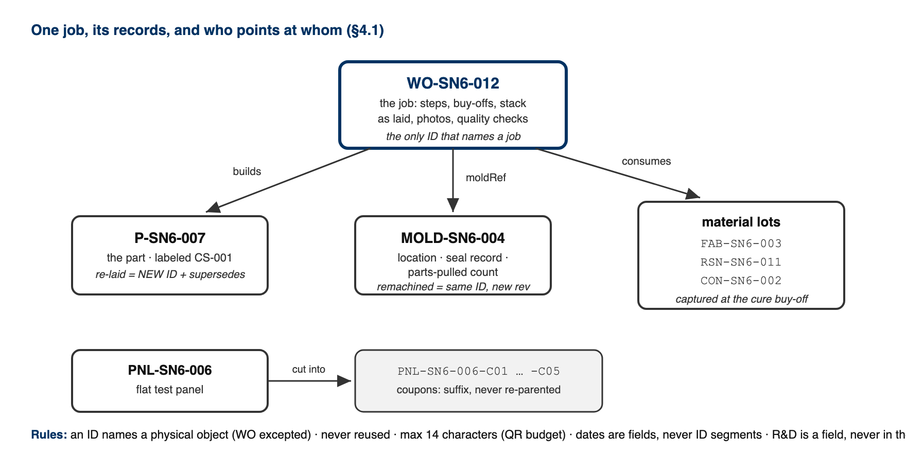

# CS-013 Work Orders & Part Traceability

| | |
|---|---|
| **Doc ID** | CS-013 |
| **Title** | Work Orders & Part Traceability |
| **Revision** | E |
| **Status** | Draft, pending Lead signature |
| **Effective date** | 2026-08-28 |
| **Supersedes** | Master Tracker part rows as the only part record |

**Approvals**

| Role | Name | Date |
|---|---|---|
| Author | Simon Starbuck (drafted with Claude, SN6 Resources) | 2026-07-12 |
| Reviewer | simon (reviewer agent) | |
| Approver (Composites Lead) | | |

**Revision history**

| Rev | Date | Author | Description of change |
|---|---|---|---|
| A | 2026-07-12 | Claude | Initial issue, defines the WO record and its authority rules |
| B | 2026-07-28 | Claude | Corrected the app description throughout: it's the live Firebase app now, not `work-orders.html`; buy-off, Backup/Restore, and photo-attachment wording updated to match. Language pass (fewer em dashes, less decorative bold). |
| C | 2026-08-03 | Claude | Added §4.1, the ID grammar, which had no controlling document: the prefix table, the rule that an ID names a physical object and never a job, non-reuse, and `supersedes` for a re-laid part. Molds, material lots, test panels and storage locations became real records, so §7.2 now points `moldRef` at a mold record rather than only at a free-text string. §7.2 also gains lot capture at the cure buy-off. |
| D | 2026-08-26 | Claude | Defined the R&D part / R&D WO in §4 and added the marking step to §7.1. R&D is a property of the object and orthogonal to status, so it does not join the status enum and does not displace the retro sentinel — the two can be true of the same record, and unlike a retro record an R&D one still enforces. §8 gains the check that catches an unmarked R&D build. The ID grammar is unchanged: R&D lives in a field, never in an ID, because the ID must survive a build being moved into the season. |
| E | 2026-08-28 | Claude | Engineering pass (CS-000 Rev C conventions). Figure 1 draws the record graph (which record points at which, and which rules keep the pointers true) because §4.1's four rules are relationships, and relationships read better drawn. No rule changed. |

---

## 1. Purpose

The Master Tracker did its job at the fleet level: parts, owners, deadlines, all visible. What it never gave us was the *part-level* record: steps, buy-offs, the stack as actually laid, measurements, photos. All of that lived in Slack threads and people's heads (PP-09). A work order (WO) is one part's complete record, spec through blockers through execution through evidence, on a screen or printed and kept with the part.

## 2. Scope

Every manufactured composites part and mold, including small cross-team jobs (the catch-can class of work, PP-05) and R&D coupons feeding decisions. If it consumes carbon or machine time, it gets a WO.

## 3. References

| Ref | Document | Where |
|---|---|---|
| R1 | PP-09, PP-05, PP-03 RCAs | FEB-COMP-PP-001 |
| R2 | The work-order app (live, Firebase-backed) | `03 App/app/README.md`, live at feb-composites.web.app |
| R2b | `work-orders.html`, the original offline single-file version, kept as a backup/archive viewer only, not the primary system | `03 App/work-orders.html` |
| R3 | CS-002 (stack), CS-003 §7.2 (design review), CS-006/007 (process records) | this series |
| R4 | CS-000 (revision rules apply to WOs) | CS-000 |

## 4. Definitions

- **WO ID**: `WO-SNx-###`, assigned from the app (or the next free number in the printed log). Never reused.
- **Buy-off**: the signed-in team member's name, email, and timestamp, recorded by the app when they click a step's buy-off button (self-buy-off allowed except where a step names an independent reviewer, e.g. mold design review). That's a real step up from typed initials, but it isn't tamper-proof: any roster member can still edit any record, so treat it as "who was signed in when this was clicked," not a notarized signature.
- **Blocker step**: a step that blocks everything after it until it's bought off (stack freeze, design review, drop test).
- **Retro WO**: a back-filled historical record (all `WO-SN5-*`); its unverifiable fields say "not recorded (retro)"; retro records are honest references, not exemplars of process compliance.
- **R&D part / R&D WO**: a build that feeds a decision rather than the car: coupon campaigns, flat test panels, layup trials, sealing and grounding experiments, mold shakedowns. An R&D build is **real**: real carbon, real machine time, real cost, real deadline, and a full record under this standard. What it is not is a season deliverable, so it is excluded from the season part list, from the Season blueprint and from the Master Tracker mirror; it is counted and marked everywhere else. **R&D is a property of the object, not a status:** a work order is R&D on the day it is a Draft and still R&D when it is Complete, and an R&D work order enforces its blockers, cure holds and evidence gates exactly like any other. Marked `R&D` on screen, on the label (CS-001 §7.6), on the printed traveler and on the public scan page. The flag lives on the **part**; a work order inherits it from the part it builds, and a work order with no part carries its own.

### 4.1 The ID grammar

Until Rev C the only controlled identifier in the whole system was the WO ID. A mold was free text inside one work order, a material lot was the colour of its packaging, and a tensile coupon was a trailing integer in a filename. This is the grammar for all of it.

```
PREFIX-SNx-###          e.g. MOLD-SN6-004, P-SN6-007, RSN-SN6-011
PNL-SNx-###-Cnn         a coupon, e.g. PNL-SN6-006-C03
```

| Prefix | What it names |
|---|---|
| `WO` | a work order (the job) |
| `P` | a part |
| `MOLD` | a mold |
| `PNL` | a flat test panel |
| `BRD` | a tooling-board sheet or offcut |
| `FAB` | a fabric roll or usable offcut |
| `RSN` | a resin or hardener lot |
| `CON` | a consumable lot |
| `JIG` | a jig or fixture |
| `BIN` | a storage location |
| `PROJ` | a ticket. **Not a physical object, and never gets a printed label** (CS-001 §4). |

Four rules:

1. **An ID names a physical object, never a job.** The one exception is `WO`, which is the job. Encode a work order into a part's ID and every re-lay either lies or forces a relabel.
2. **IDs are never reused**, across seasons or after a delete. The season segment (`SN5`, `SN6`) partitions the namespaces, so SN5 IDs are frozen and stay valid forever.
3. **A re-laid part is a new part.** Scrap a part for porosity and lay it again and that is a different piece of carbon: new `P` ID, new work order, and `supersedes` pointing at the old one. The mold's ID, the board's ID and every existing label are untouched.
4. **A remachined mold keeps its ID.** It is the same physical object at a new revision, so the revision letter changes and the label is reprinted; the ID does not move.

An ID is capped at **14 characters** by the QR code: version 3 at 25% error correction holds 47 alphanumeric characters, of which the host takes 30 and `/Q/` takes 3. Everything above fits. A coupon at 15 characters does not, which is consistent with coupon labels being text only (CS-001 §7.6).



Dates are **fields, never ID segments.** A session that starts 23:50 and ends 00:10 has two valid dates, and a date typed wrong into an ID can only be corrected with acetone, while a date typed wrong into a field is corrected with an edit.

## 5. Equipment & Materials

The WO app (R2): a shared workspace at feb-composites.web.app, running on Firebase. Sign in with email and password; a lead has to add your email to the roster before you can see or touch anything. Every edit saves live to a shared database, so the whole team sees the same record at once; there's nothing to import or merge. `work-orders.html` (R2b) still opens any exported JSON with no server at all, and stays useful as an offline archive viewer, but it's not where day-to-day work happens anymore. Printed WOs: any printer + a pen at RFS.

## 6. Safety

No physical hazards; process standard. (Safety content lives in the process standards each WO step cites.)

## 7. Procedure

### 7.1 Create

1. Open the app → New Work Order → it assigns the next `WO-SN6-###`.
2. Fill at creation (this is the PP-04/PP-05 fix: requirements exist before work): part name, subteam, ME/RE, due date, process type, **stack (per CS-002)**, BOM, **qualityChecks with numeric targets**, and the standard step list for the process type (the app pre-fills steps from the templates; delete inapplicable ones consciously, don't skip silently).
3. Cross-team parts: the requesting subteam's requirements (thickness, DXF rev, mass) go in the WO and their lead is named on the release sign-off.
4. **Mark it R&D at creation if the build feeds a decision rather than the car** (§4). The app offers it as its own button rather than a question: *R&D part* beside *New Part*, *R&D run* beside *New WO*, and a run started from an R&D part inherits the mark with nothing to remember. It can be changed afterwards while the part still has no work order against it; once real work exists, only the Composites Lead can move it into the season, only once, and never back. The part keeps its ID when it moves (§4.1 rule 2), so its label, its traveler and its QR all stay valid.

### 7.2 Execute

1. Work the steps in order; blocker steps block until bought off (the app enforces this; on paper the blocker rows are shaded: no initials, no moving on).
2. Each step: status, buy-off (signed-in name + timestamp), notes, photo references (phone photos → the part's Drive folder, filename written on the WO step; WO steps don't take a real upload yet; Tickets and Documents do, see `03 App/app/README.md`).
3. Deviations from the frozen stack/spec = WO revision (CS-000 rules): quick, visible, counted. The revision letter rides the WO header.
4. **Which lots went in.** Buying off an infusion or a wet layup asks which fabric roll, which resin lot and which hardener lot, alongside the resin system and the finish time it already asked for. Each field is pre-filled with whatever is currently open, so the usual answer is one confirmation. **"I don't know" is a valid answer** and is recorded as such. That is deliberate: a gate that can only be satisfied by naming a lot gets satisfied by naming the wrong one, and a confident wrong lot is worse than an honest gap (§8, and the same principle as the retro sentinel in §4).
5. Point the work order at a **mold record** (`MOLD-SNx-###`) rather than only naming one. The mold's location, sealing record and parts-pulled count then live on the mold, where they stay true across every work order that uses it, instead of being copied into each one.
6. Update the mold's location whenever it physically moves (PP-10). Scanning the mold and then the shelf is the fastest way and needs no typing.

### 7.3 Close

1. Fill qualityChecks actuals (mass, thickness, Ω table, etc.), attach final photos, mark status Complete.
2. Nothing to export by hand: every save writes straight to the shared database and is live for the whole team immediately. The durable archive is the lead's **monthly Backup** (header button) into the team Drive: Firestore is reliable, but a plain JSON file nobody can lock the team out of is the backup that matters. Restore, lead-only, reads that file back.
3. Print one copy for the physical binder at RFS if the part is safety/inspection-relevant (mech tech evidence).

### 7.4 Weekly use

1. Monday meeting: the app's list view (filter: InWork) *is* the part status board; it replaces re-asking "where is X?" and feeds the weekly summary.
2. The lead runs Backup (one click, header) monthly; see §7.3. Nothing weekly is required since the database itself is always current; monthly is just the archive cadence.

## 8. Quality checks / acceptance criteria

| Check | Target | Method | Record where |
|---|---|---|---|
| Every active part has a WO | 100% of parts consuming carbon/machine time | Lead check at Monday meeting | — |
| Blocker steps bought off in order | No downstream work past an unfinished blocker | App enforcement / shaded rows on paper | WO |
| Monthly Backup run | Every month during build season | Lead | Drive folder timestamps |
| Retro honesty | No fabricated buy-offs on retro WOs | "not recorded (retro)" convention | WO fields |
| R&D builds are marked as such | 100% | Lead check at Monday meeting: a part not in the season plan is either marked R&D or is a gap | Part `rnd` flag |

## 9. Records

The live database is the team's day-to-day part-history record, shared and current for everyone at once; the monthly Backup JSON in Drive is the archive nobody can lock the team out of. Master-Tracker-style views (spreadsheets, summaries) may continue as *views* built from that record. The WO is the source of truth (same rule as CS-002 §9).
