# FEB Composites, hosted app

Live at https://feb-composites.web.app. It's a tabbed workspace for everything
composites tracks over a season, not just work orders. Everyone signs in with
email and password, and the Firestore database is shared, updating live for the
whole team. Set your photo by clicking your avatar at top right.

This file is the app's manual. In order: [the tabs](#the-tabs), then
[labels](#labels) and [scanning](#scanning), [which lots went
in](#which-lots-went-in), [getting around](#getting-around), [how access
works](#how-access-works), [what a buy-off is](#what-a-buy-off-is-and-isnt),
[files and photos](#files-photos-and-watchers), [project
setup](#one-time-project-setup) for standing the Firebase project up again,
[day-to-day care](#day-to-day) and [cost](#cost).

If you are the next lead, read `../../HANDOFF.md` first. If you are here to
change the code, read `DESIGN-NOTES.md` — it holds the decisions behind what
this file describes, and the reasons not to undo them.

The screenshots through this file regenerate with
`node tools/make_mockups.mjs`, so if one looks stale, rerun that.

## The tabs

### Dashboard

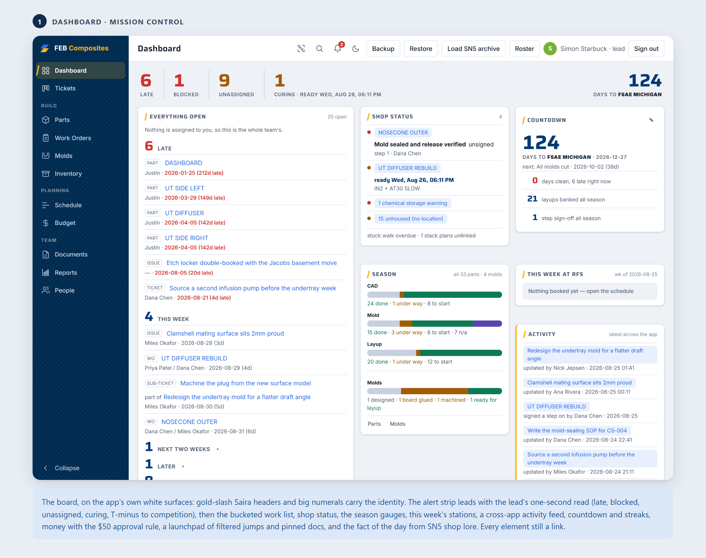

The landing page is the board: read-only, every element linking into the tab it
came from. On a phone it stacks today-first.

The **alert strip** leads with the lead's one-second read, team-wide: late,
blocked, unassigned (open work with no owner), curing with the soonest ready-at
clock, and T-minus to the competition. All quiet renders a green all-clear cell.

The modules under it:

- **The work list** — one grouped deadline list, an item in exactly one bucket,
  with a part and its work order merged into one row. Late and This week render
  open; the quieter buckets fold.
- **Shop status** — what is blocked, what is curing (a clock time, never a
  countdown), and the Inventory warnings in one severity-dotted list. A clean
  shop reads a single "All clear" line.
- **Season** — the stage bars plus the molds pipeline, counts printed as words
  for colourblind safety.
- **This week at RFS** — only the booked stations.
- **Activity** — a cross-app feed of what changed, one event per record per day,
  with watched tickets that changed pinned on top.
- **Countdown** — T-minus, the next milestone, and three all-season counters
  (days since a missed deadline, layups banked, sign-offs). A lead sets the
  season name, date and milestones in one modal.
- **Money** — the unreimbursed sum plus the $50 approval rule.
- **Launchpad** — filtered jumps (my tickets, late WOs, the reorder list, the
  week plan), a jump to Documents, and the pinned Google links.
- **Shop knowledge** — rotates a fact a day, most of them mined from the team's
  own SN5 documentation. On competition day the board wears gold and tells you
  to go run the car.

Empty states shrink the page instead of padding it.

### How parts, runs and molds fit together

The part is the parent record. It is the thing the car needs, and it outlives
every attempt at making it. Everything else hangs off it:

```
Part ─┬─ Work orders   one RUN each at making it (a remake is a second run)
      ├─ Mold ── Mold file ── Drawings
      ├─ Tickets
      └─ Scheduled weeks
```

Every record in that chain shows the same lineage bar across the top, so you
can walk up to the part or down to the drawings from wherever you are.

Older records join by part name rather than by a real link, and the app says so:
a run matched that way is labelled *matched by name* with a **Confirm** button
that writes the real one. Most of the SN5 data starts out matched by name and
gets promoted one part at a time as people open things. Two parts sharing a name
is the one case that refuses to guess — there is no way to know whose run an
unlabelled work order was, and duplicate part names are a real pattern here.

**+ New run** on a part starts another work order against it, carrying the
part's name, subteam, deadline, mass target, process and layup plan. A part
that already has runs asks first: **Start fresh** from the part's own plan, or
**Use a previous run** — pick the source run and tick what to keep (the mold
and its mold file, the uploaded files and doc links, the as-built layup stack,
the BOM, the quality criteria with actuals blanked). Everything carried is a
reference to records that already exist, so a botched mold machining gets a
second run with the same mold CAD without re-uploading a thing. A carried stack
is labelled as-built, so if it differs from the part's plan the divergence
banner says so instead of pretending it follows the plan.

The mold works the same way: until somebody commits the link the mold is
derived through the part's runs and shown as *via WO-…*. Set it once and the
mold's own "used by" list and the QR label pick it up. A part's mold progress
and the mold record's stage are deliberately **not** synced — they are different
scales maintained by different people, so the app points out when they disagree
rather than quietly overwriting one.

### Work Orders

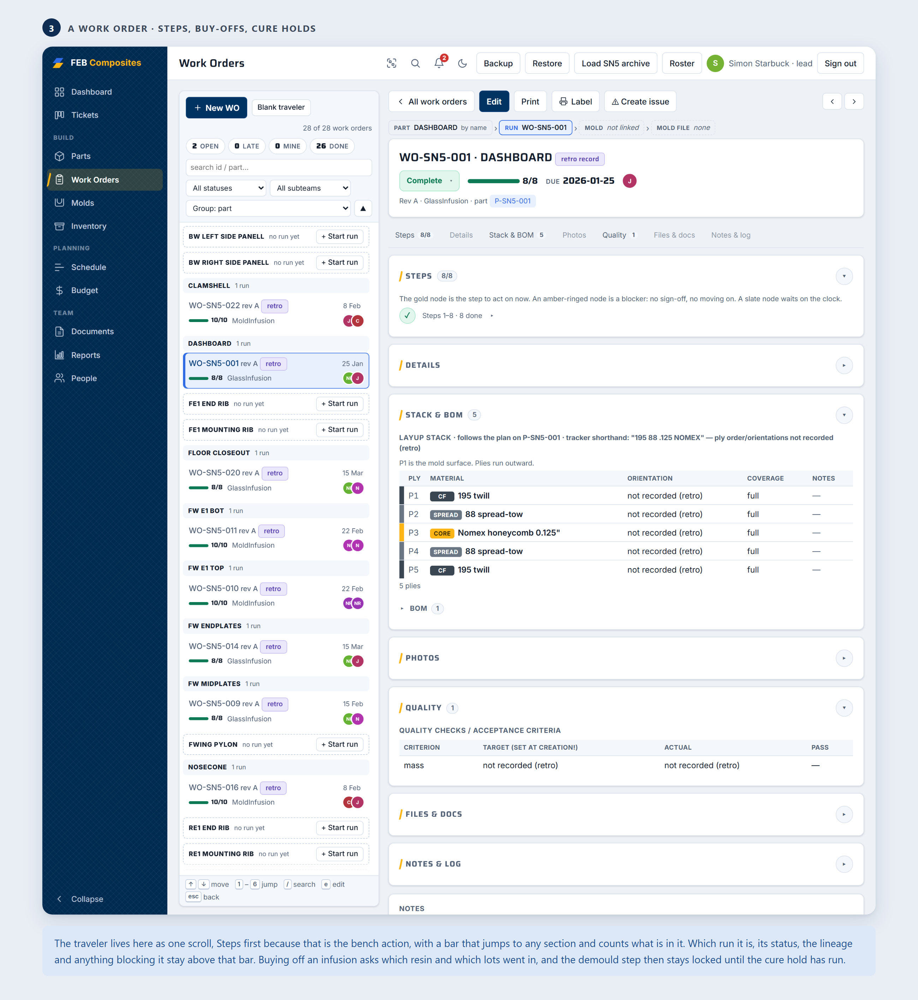

Work Orders is the manufacturing traveler: layup stack, BOM, step buy-offs
stamped with who signed them, blocker enforcement, enforced cure holds, and a
printable hand-fillable sheet that is always exactly two pages. A lead can
override a cure hold from the "Why N hours?" modal, but never below the
datasheet's own floor.

It is a split view, like Parts and Molds. The rail indexes every run grouped by
the part it builds; each row shows how far through its buy-offs the run is and
whether it is blocked or curing. Runs whose part cannot be resolved collect in a
named block at the bottom — on the SN5 archive that is most of them, and it is
the to-do list for linking them up. Parts nobody has started appear too, with
the button that starts a run. Group, sort and filter are yours to set.

The pane is one scroll, ordered Steps, Details, Stack & BOM, Photos, Quality,
Files & docs, Notes & log. Steps leads because that is what you came to do. A
bar above it jumps to any section (`1`-`7` from the keyboard) and carries a
count per section, plus a dot when something wants attention, so you can see
there are five plies or that a check failed without scrolling to find out.

The BOM inside Stack & BOM is the run's **plan vs as-built** record. A run
copies its part's Materials (plan) at creation, and the read view shows Plan,
Used and Cost per line with a money summary beside the count ("planned ≈ $41.20
· used $63.00"). **Consume** on a line logs what actually went in: the cost
freezes at that moment's unit price, a board ref decrements the shelf count, and
a lot ref asks the only honest stock question free-text quantities allow —
still fine, running low, or now empty. The cure buy-off asks the same question
for every open line at once, prefilled from the plan, so the common case is one
confirm and zero typing; a consumed line never logs twice, and the undo bar
covers the whole batch. When a run's actuals differ from the plan, an **↩ plan**
button pushes reality back onto the part, so the next run starts from what the
last one learned. The printed traveler carries the costs and a materials total.

Every section header is also a fold. Steps and Stack & BOM open by default (you
read the stack while signing "Stack frozen"); the reference sections start
closed, a warned section never starts closed, and edit mode opens everything.
Folds keep their state while you stay on the record and reset when you switch.
Notes & log opens itself with a gold "new" dot when somebody wrote a note since
you last looked. Gold means new, amber means trouble, and the two dots never
trade jobs.

The steps read as a traveler spine: a hairline runs down the number column and
each step's number is a circular node on it — green ✓ walked, the one gold node
is the step to act on NOW, an amber ring is a blocker, slate ◷ waits on a cure
clock, red ✗ failed, and an outline node on a dashed spine has not been walked
yet. Four or more consecutive signed steps compress into one counted line
("Steps 1–8 · 8 done · 9 photos") with the full rows one tap inside, so a
half-signed record reads solid green, one gold node, then dashed, from across
the bench.

What is true of the whole record stays above that bar: which run it is, its
status, the lineage bar, and anything blocking it, including a cure hold, shown
as a clock time rather than a countdown. Unlike Parts, this rail does not hide
finished runs by default, because reading back what was done is half of what a
traveler is for.

A work order is one run at making a part, so its layup stack is what that run
**actually laid**, while the part's stack is the **plan**. Editing the plan
pushes it to every run still following it; editing a run's stack marks that run
as-built and never writes back. When they differ the run says how many plies
moved, with a side-by-side compare and an explicit *Adopt as the part's plan*. A
run whose "Stack frozen" step is signed is left alone by plan edits entirely —
the bench is working to that piece of paper.

The stack itself is an editable table: change any field in place, insert a ply
above another, duplicate, reorder toward or away from the mold surface, or
delete. P1 is the mold surface and the table says so. Two people editing the
same stack at once merge rather than overwrite each other; only reordering is
last-writer-wins, because two people reordering the same stack has no correct
answer.

Material colour is a swatch beside a short text tag (CF, Spread, Core, Mesh), so
the distinction survives greyscale, a colour-blind reader and the black-and-white
laser. Hue is never the only thing carrying the meaning.

### Parts

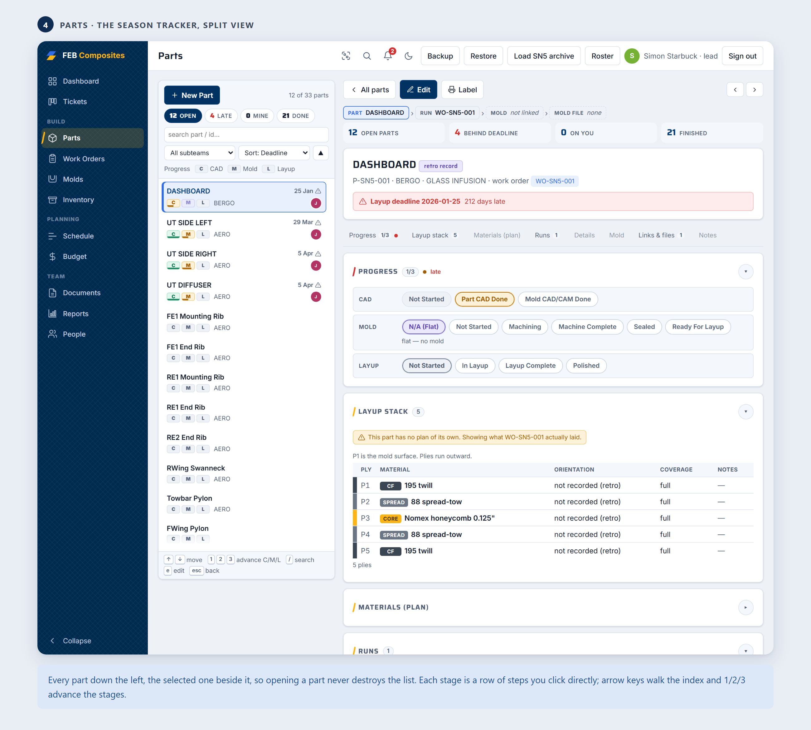

Parts is last season's Part Tracker reborn, and it leads the Build group because
the part is where the work starts. Each part carries three parallel progress
stages (CAD, Mold, Layup) plus subteam, layup type and schedule, engineers,
target weight, and a layup deadline.

The page is built from the same section cards as a work order: a jump bar with a
count per section and a warn dot, Progress, the layup stack and the runs open by
default, and the reference sections folded until asked for.

**Materials (plan)** sits between the stack and the runs: the part's expected
bill of materials. A line is either free text or picked from inventory, and a
picked line prices itself live from that record's unit cost (qty × $/unit), so
the section header can say what the part should cost to make. The rollup always
carries its coverage ("≈ $66.50 · 1 unpriced") — a sum over gaps never pretends
to be complete, and an empty plan says nothing rather than $0.00.

Its **Runs** section is the rest of the picture: every run against the part with
status, due date and ply count. The **Mold** section holds the mold and its
**mold file**, with buttons straight to the 3D view and the drawings; tickets
and scheduled weeks live under **Links & files**.

("Mold file" is the stack plan record, `STK-…`: the slicer's output for how the
mold gets cut out of tooling board. The lineage bar and the part page call it
the mold file because those screens already use "the plan" for the *layup*
plan, and two different plans on one screen is confusing. The Molds tab, where
it is shown as a record in its own right, still calls it a stack plan.)

SN5 parts have no layup plan of their own — the old tracker recorded the layup
against the job, not the part — so a part with no plan shows what its run
actually laid, labelled as borrowed, with one click to adopt it as the plan.

Above 900px it is a split: an index of every part down the left, the selected
part beside it. Opening a part does not destroy the list and going back does not
destroy the part, so you can work down your own parts without the page swapping
under you: `↑`/`↓` or `j`/`k` walk the index, `1`/`2`/`3` advance CAD, Mold and
Layup on whatever is open, `/` searches and `esc` clears. With nothing selected
the right pane is the season instead: how the open parts are spread across the
three stages, and who owns what is behind. Below 900px the index is the page,
tapping opens the part, back returns.

Each stage is a row of its own steps, and you set it by clicking the step you
want. There is no edit mode for progress, because advancing a stage is the thing
people do most and it used to cost five interactions. Moving forward one step
writes immediately and leaves an undo; moving backwards, declaring a part flat,
or skipping steps asks first and names what it would skip. This is a live shared
database, so the surprising directions are the ones that get a confirmation.

A stage that hasn't started reads grey, never amber.

### Molds

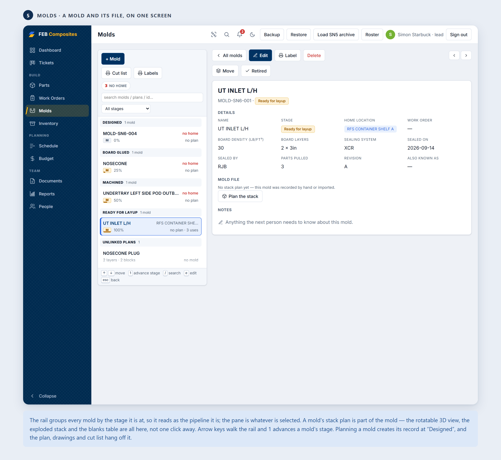

Molds is a Parts-style split: a persistent rail on the left, the selected record
on the right. The rail groups every mold by the stage it is at, in process
order, so it reads as the pipeline it is; a stage nobody is at gets no header.
Arrow keys or j/k walk the rail, `1` advances the selected mold one named stage
with the same undo bar as the button, `/` searches, esc goes back. On a phone it
collapses to list-then-detail, exactly like Parts.

A **mold** used to exist only as free text inside one work order, so two work
orders using the same mold held two copies of the truth and its location was
wrong the moment anybody moved it. Now it is a record with its own stage, home
location, sealing date and a count of parts pulled off it; the work orders and
parts that used it are a live join.

A mold's **stack plan is part of the mold**, not a record beside it. The
rotatable 3D view of the mold sitting inside its translucent stock, the exploded
stack, the blanks table, the drawings and the STL export are all on the mold's
own page. Only a plan with no mold to be reached through gets a row of its own.

**Board grade is typed, not picked from a list.** The shop mostly runs 30 and
60 pcf, but the rack has always held sheets of other grades and the old dropdown
refused to say so — a mold set to 45 matched no board at all and silently
re-prefilled as 30. Entry is free, with the catalogue plus whatever is actually
on the rack offered as suggestions.

**Plan a mold** takes an STL (or a typed rectangular block), picks board
thicknesses that waste the least, splits tall molds at the ShopSabre's
cut-depth limit, prints a numbered cut list and a dimensioned engineering
drawing set, shows the mold sitting inside translucent stock in a rotatable 3D
view, and exports the planned blocks back out as STL so CAM can use them as the
stock body. Planning also creates the mold record itself, at "Designed", with
the plan linked to it, so the record exists from day one of design instead of
being back-filled after machining. Three sample molds ship with the app, so the
planner can be tried without exporting anything from Fusion.

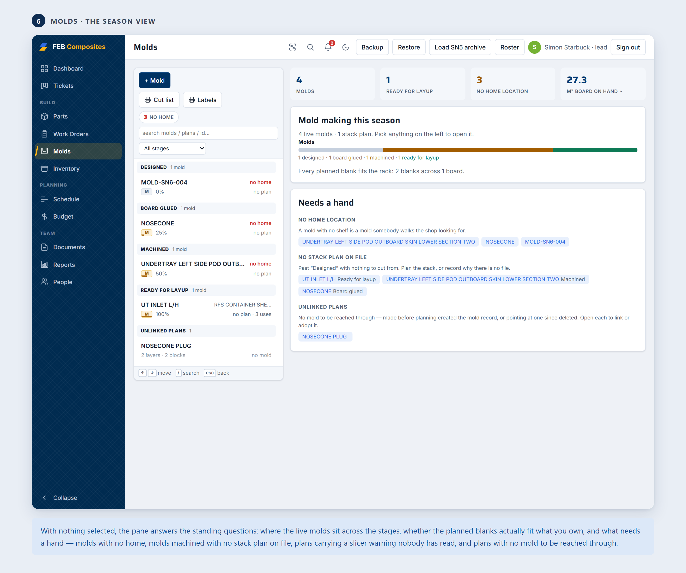

With nothing selected, the right pane is the season: where the live molds sit
across the stages, how much board is on hand (a tile that opens the rack in
Inventory), and whether the planned blanks actually fit it. Below that, "Needs
a hand" — rendered only when it has something in it — collects the four
questions that were previously answered in four places or nowhere: molds with no
home location, molds past "Designed" with no stack plan on file, plans carrying
a slicer warning nobody has read, and plans with no mold to be reached through.

The rack itself is not here. A board is a thing on a shelf, so it lives in
Inventory beside the items and the materials; see below.

### Tickets

Tickets is a jira-style tracker holding two kinds: projects (R&D, process fixes,
outreach, and they can have sub-tickets) and issues (a production
nonconformance, which needs a work order, a disposition and a documented root
cause before it can close). The tab is the same master-detail split as Parts,
Work Orders and Molds: a rail of every ticket on the left, grouped Projects then
Issues with each sub-ticket nested under its parent, and the open ticket beside
it. With nothing selected the pane is the kanban board (To Do, In Progress,
Collecting Data, On Hold, Done, Cancelled), and dragging a card between columns
changes its status. The rail is the list, with open/late/mine/done chips, a kind
filter, search, and the arrow keys.

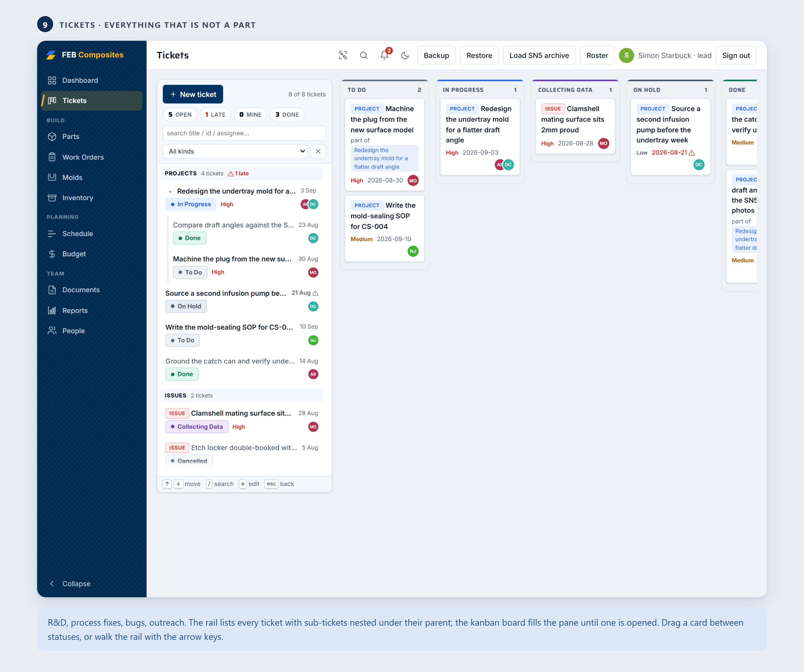

Each ticket's page opens with a lineage bar: a sub-ticket names its parent,
hyperlinked, and an issue walks Issue, then its run, then the part the run was
building, ghosting whatever is not linked yet. A jump bar counts what is in each
section (an issue that still cannot close carries a warning dot) and digits 1-5
scroll to them. Sub-tickets are a real children table with status, due date,
lateness, priority and assignees, and the New sub-ticket modal starts from the
parent: related parts and work orders carry over, the due date defaults to the
parent's and is capped there. The comment thread reads newest-first with the
composer at the top, and on a phone the description and discussion come before
the metadata instead of five screens after it.

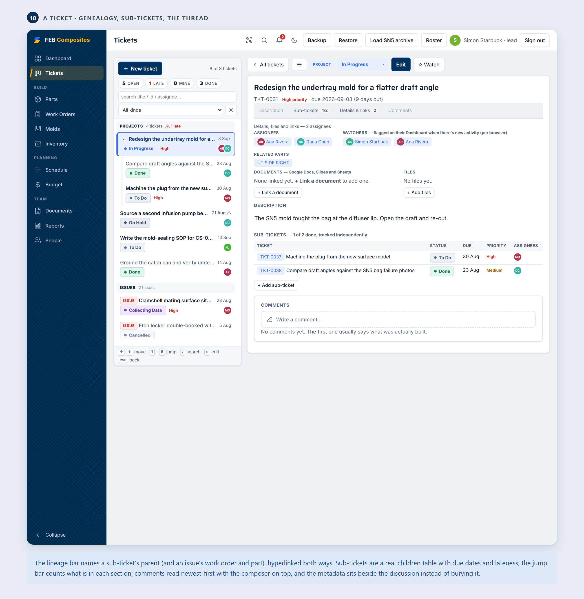

Issues close from the page you read them on. An open issue carries a resolve
band: the disposition select saves the moment it changes (disposed-but-open is a
real state — it is what lets the work order complete while the ticket stays open
for follow-up), the root cause is the field right above, and one Resolve button
closes through the same gate and single Slack announcement as every other path.
A closed issue reads "Resolved" with a quiet Reopen; reopening clears the
disposition, so a work order can never complete over an issue somebody just said
is not actually fixed — the withdrawn method survives as a comment.

Filing got cheap at the bench too. Every work-order step carries a small flag
button beside its camera: one modal with the title prefilled from the step, the
defect photos attached at creation, priority, and nothing else — the work order,
assignee, subteam and watchers are already known. The issue remembers which step
it came from, shows as a chip on that step (amber while open, a check once
disposed), and you stay on the work order. And when someone sets a work order to
Complete while issues are still open, the refusal opens a closeout modal instead
of a dead end: one row per issue with its step context, disposition and root
cause inline, per-row Resolve or "Resolve all & complete work order", and a
confirmed "Cancel ticket (false alarm)" for the ones that turned out not to be
real. Every resolve saves immediately, so backing out mid-way loses nothing.

### Schedule

One tab, two views behind a toggle: the season by station, and the week by
person. They were separate Timeline and Weekly Plan tabs until 2026-08; old
links to either still land in the right view.


The season view is the production schedule as a station by week grid: stations
are the rows, weeks are the columns, and tapping a cell picks the part that runs
at that station that week. Every write leaves an undo bar, because it changes a
schedule the whole team reads. The current week is called out in gold, and "Jump
to this week" finds it in a long season. On a phone the grid becomes one card
per week listing only what is booked, with finished weeks folded behind a button
so this week is the first thing on screen. Undated weeks from the SN5 import sit
in a collapsed archive below the live schedule.

The week view is the same schedule cut the other way: one card per day, split by
car group, saying what happens and who is at RFS, plus a per-person weekly
rollup pulled from ticket due dates and manual assignments.

### Budget, People, Documents

Budget runs purchase requests through Submitted, Ordered and Reimbursed, with
the season total, an open-orders subtotal, and a flag on anything over $50.

A purchase can carry **line items**: one row per thing, typed the way a receipt
reads (total and count) with the unit price deriving live as you type — $20
across 4 shows $5.00 ea before you leave the cell. Lines never change the cost
field on their own; instead the section shows the line sum with a quiet "matches
cost" chip when the two agree, and a warning plus an explicit **= set cost from
lines** button when they don't. Whether a line's contents ever reached a shelf
shows in Inventory's Incoming strip. The budget CSV exports both cost and the
line sum, so a mismatch survives into the spreadsheet.

With a receipt photo attached, **✨ Fill from receipt** reads it into proposed
lines. Parsing only ever prefills the same editable grid: every cell stays
fixable, existing lines are never touched without a confirm, and if the service
is down the button says so and the manual editor carries on.

People is the team roster with photos, roles, and each person's live assignments
across parts, projects and work orders. Leads can set roles, and trainings are
granted here: capsule pills on the list, a bulk "Record training session" modal
for the night a group gets certified, and a per-person checklist for
corrections. A Matrix toggle flips the tab into the planning read — rows are
people, columns are trainings with a coverage count over the full roster, and a
lead clicks a cell to certify or revoke on the spot (members see the same grid
read-only, provenance in the tooltip). The catalog is lead-editable under the
Catalog button: the six built-ins can be renamed but never removed, while new
trainings (a name, a ≤4-character code, optionally the CS standard that is its
curriculum) archive instead of deleting, so every historic grant keeps rendering
its name. A new training gates nothing until a step template references it —
adding to the catalog is bookkeeping, gating stays a deliberate act.

Documents is the team shelf (pinned links to the things people keep asking for),
member uploads, and the shop printables. Anyone can upload a doc.

It used to bundle the reference library too: 25 manufacturer datasheets and the
CS standards and pain-points. Simon asked for those off the app on 2026-08-18,
and they are **unlisted rather than deleted** — the files are still in `docs/`
and still served, because `resins.js` deep-links six datasheet PDFs by path for
its TDS citations and CS-000 requires an issued standard to stay retrievable.
The switch is `UNLISTED` in `tools/gen_docs_manifest.py`; empty that set to put
them back.

### Inventory

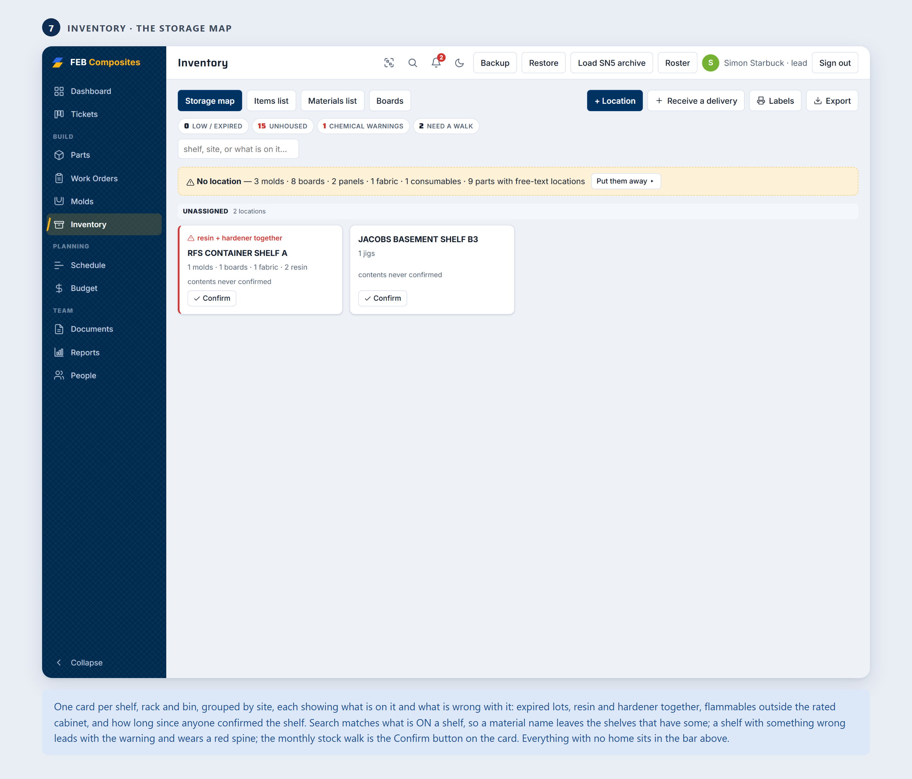

Inventory is the storage map, and it absorbed the Items and Materials tabs. The
default view is one card per storage location (shelf, rack, cabinet, bin),
grouped by CS-011 site, each showing a live summary of its contents and its
problems: expired lots, resin and hardener sharing a shelf, a flammable lot
outside the rated cabinet (§6 as warning chips), things flagged running low, and
how long since anyone confirmed the shelf.

The map is filtered, not a wall. A search box matches a shelf on its own name,
site or kind **or** on the name, vendor lot or material type of anything on it,
so "195 twill" leaves the shelves that actually have some; the four summary
chips are real filters. Cards sort alerts first, then never-walked, then stale,
then — within a rank — shelves with something on them before empty ones, then by
name. A fixed order, because the map's job is to put what is wrong in front of
you. A shelf with a bad warning leads with the warning and wears a red spine.

Every location is a card, including the empty ones, and clicking anywhere on a
card opens that shelf. An empty shelf is drawn quieter — inset surface, no
shadow — and its site header counts how many of the site's locations are empty.

New shelves are created here, with **+ Location**. **Confirm contents** is on
the card, so CS-011 §7.1's monthly walk is one click from the map. Everything
unhoused sits in a bar above the shelves.

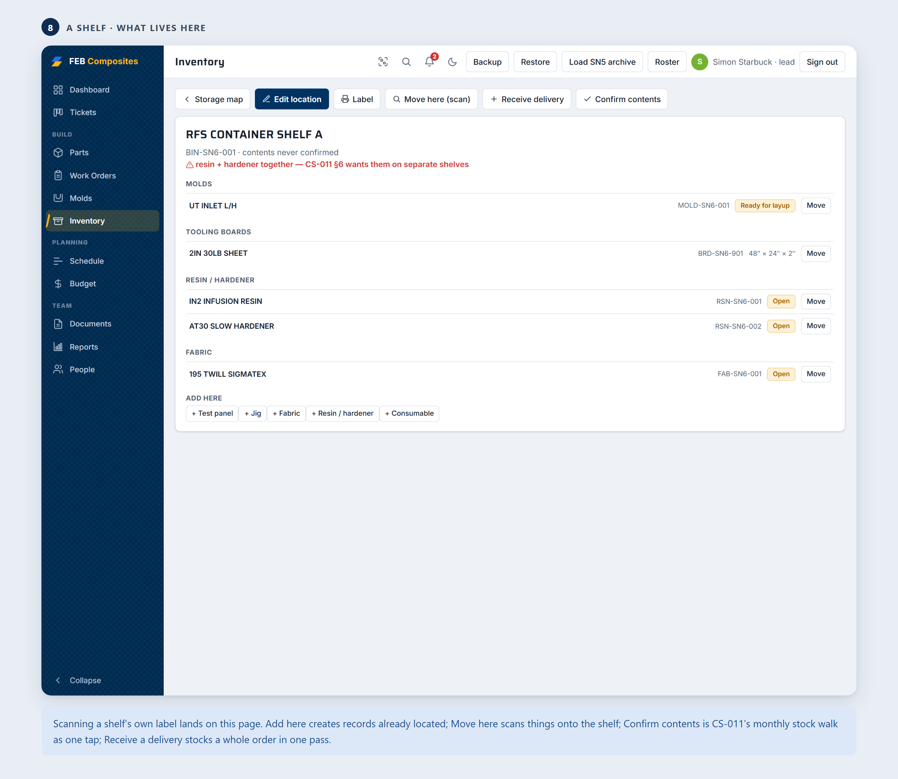

Tap a card, or scan the shelf's own front-edge label, and you are on its
contents page: every mold, board, panel, jig, lot and part that lives there,
each with a Move button. **Add here** creates a record already located. **Move
here** scans the label on each thing you are putting down, the inverse of the
Move flow — and the camera stays open between codes, so a pile is one scan each
rather than one modal each. **Confirm contents** stamps who walked the shelf and
when. The Items-list and Materials-list toggles keep the old flat tables.

#### Boards

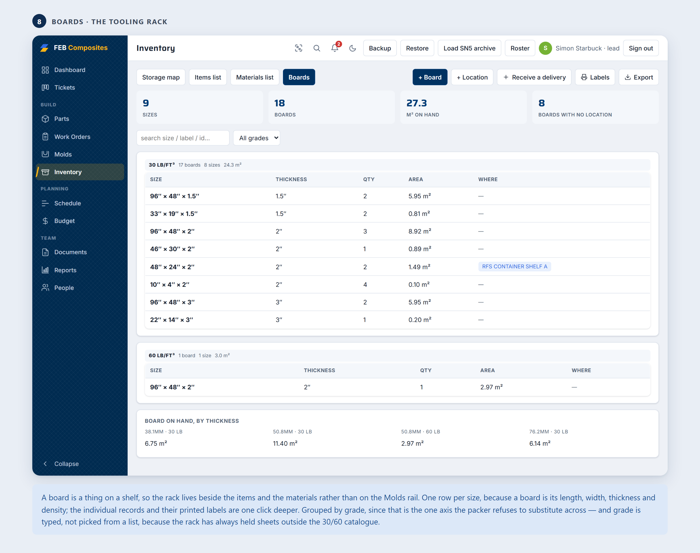

The fourth toggle is the tooling rack, which used to be a third group on the
Molds rail. A board is a thing on a shelf, and this is where the shelves are.

A full 4×8 sheet and an offcut are the same kind of record, so remnants come
back into stock instead of piling up. The list is one row per **size**, because
a board is its length, width, thickness and density; the individual documents
are one click deeper, because a BRD- label is stuck to a physical board and a
mold points at the one it was cut from. Sizes are grouped by **grade**, since
that is the one axis the packer refuses to substitute across (CS-004 — 60lb
seals better, and you cannot swap it in silently), which makes it the axis that
decides whether a job can be cut at all.

Molds keeps exactly one number: the m² on hand, as a tile that opens this list.
"Have we got board" is a mold-making question even though the rack is not a
mold-making record.

#### Receiving

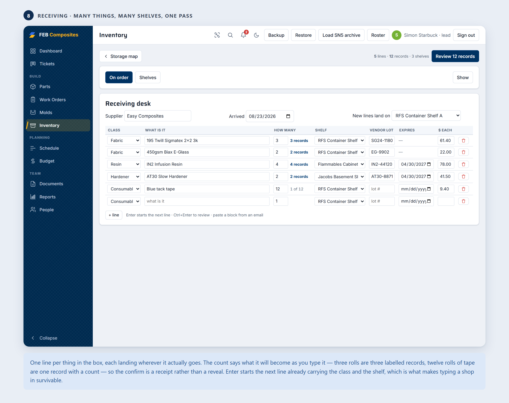

**Receive a delivery** is a page, not a dialog: a working sheet with an index
above it, reached from the map's toolbar, from an Incoming line, or from a
shelf. It replaced a modal that took ONE destination shelf for a whole delivery,
which was wrong for the commonest case — a mixed Easy Composites order is rolls
and jugs and consumables belonging on three different shelves.

Enter commits a line and opens the next one already carrying the class, shelf
and supplier, so a stock-take line is name, Tab, count, Enter. The class cell
offers Fabric / Resin / Hardener / Consumable, which is what finally lets the §6
resin-and-hardener check fire at all — the old flow never asked, so every
received lot was born unable to trigger any warning. The confirm runs those
checks against what each shelf *would* hold, so a chemical-storage problem is
caught before the write.

Quantity fans out by class, live as you type: 3 in a fabric row reads "3
records" before the keystroke finishes, because fabric and resin are tracked one
container per record, and the same 3 collapses to "1 record of 3" for a
consumable. A paste from an order email becomes rows you then correct by typing
— a prefill, never a mode. "Arrived" on an Incoming line seeds the *whole*
order.

After a submit you stay in the sheet with the caret in a fresh line, and the
labels are queued on the undo bar rather than auto-printed. Undo deletes what it
created and puts the lines back on the sheet.

Partial receipt works: six of ten arriving leaves four outstanding instead of
the line vanishing.

#### Running out

The reorder signal lives on the **material**, not on the jug. That is the fix
for PP-02 — the SN5 sheet where a "Running Low" flag sat unactioned all season —
and for a reason that had gone unnoticed: the flag lived on a container, and
when the last container emptied it dropped out of every count, so being nearly
out was a chip and being completely out was silence.

CS-011 §5's minimums are lead-editable, because §5 calls them "starting values;
tune with usage data". Supplier lead time turns "you are low" into "order by
2026-10-05", and a material already on its way reads *on order · BUY-SN6-040 ·
9d ago* instead of nagging for the whole six-week lead time — a nag that is
known-stale is how the SN5 flag became wallpaper in the first place. **Add to a
purchase** creates a Submitted `Restock` BUY-; when the delivery is received the
row disappears by itself.

How full a container is, is a coarse level — Full / Half / Low / Empty — not a
number, because a number nobody can measure goes stale silently and then nobody
trusts any of it. Consumables also carry a real count, because boxes are
countable.

#### Getting the data back out

**Export** on the map, and two rows of buttons under Reports: *Everything on
every shelf* (one row per physical thing, with the shelf's NAME, its warnings,
and a link back) and *Locations* (the stock-walk checklist). Both as a .csv
download or as **Copy for Sheets**, which puts tab-separated rows on the
clipboard to paste straight into a blank sheet — and works on a phone, where a
browser download often silently does nothing.

The records themselves: **materials** are fabric rolls and offcuts, resin and
hardener lots, and consumables, which is what makes "which roll went into this
panel" answerable; **items** are test panels (stack, coupon range, lot
references: the fix for tensile data whose only identity was a filename), jigs,
and the storage locations.

Above the map sits **Incoming** — everything bought but not yet on a shelf. It
is a query over the Budget tab's purchase lines, never a second copy of the
fact: a line shows here until a received record points back at it. Rows show the
thing, its unit price, the purchase chip, the vendor, and the order age (⚠ past
14 days). **Arrived** opens the Receive flow prefilled; saving creates the lot
already priced, dated, located and linked back to the purchase, and the row
leaves the strip. Walk-in deliveries (donations, legacy stock) still go through
the plain Receive button and stay honestly un-costed. The strip renders nothing
when nothing is in the mail.

Buyable things (fabric, resin, consumables, jigs, tooling boards) also carry a
**unit cost**: a real number of dollars, with a free-text cost unit ("ea", "yd",
"kg") beside it on lots. Prices show inline on shelf rows and in the Materials
list, so browsing the map teaches what things cost instead of that knowledge
living in whoever placed the order. A record created by receiving a purchase
carries a read-only "From purchase" chip back to the budget entry that bought
it. A missing cost renders as absent, never as $0.00.

### Reports

Reports does per-dataset CSV export for parts, work orders, projects and budget,
plus a one-click printable Monday-meeting status board, and it is where you
print labels in bulk. The board is a grid of cards: stage counts coloured the
way Parts colours them, and every work order, blocker and deadline a real link
into its record; on paper it prints one section under the next, chrome-free like
every other printout.

A lead also gets three one-off migrations there: **Find molds in work orders**
proposes a mold record per distinct free-text mold name and lets a human untick
the duplicates (no algorithm should decide that "MOLD-UT-INLET" and "UT INLET
MOLD" are the same mold); **Link parts to work orders** backfills the link the
SN5 data never had, on exact one-to-one name matches only; and **Rebuild scan
mirror** re-publishes the public nameplates. **Tracker feed** is the fourth, and
it is the one described next.

## The Google Sheet mirror

The team runs the season off the Composites Master Tracker in Drive. Until this
existed, adopting the app meant either abandoning the sheet everyone already
watches or typing every part twice, which was most of why switching to the app
felt like a chore. Now the spreadsheet mirrors the app on a fifteen-minute
timer. One direction: the app is the source of truth, and anything typed into
the synced columns of the target tab is overwritten on the next run.

A lead presses **Tracker feed** under Reports once, which mints a secret token
and publishes the first snapshot. The other half is a script that lives inside
the spreadsheet; install steps, the trial-tab rollout and the handover note are
in `03 App/sheets/README.md`. Until both are done the feed URL 404s.

The token is the whole capability, the same way the Slack webhook next door is.
Anyone with the URL can read the season's part list including engineer names and
comment text, which is deliberate — the sheet has those columns, and a mirror
that dropped them would not be a mirror. **If the spreadsheet is ever set back
to restricted, revisit what the feed publishes in the same breath**, since the
case for publishing them leans on that data already being link-readable.

Staleness is not the failure mode it looks like. The app is the only place part
edits happen, so "nobody has had the app open" means the snapshot is stale and
correct. What the sheet cannot tell you on its own is whether the sync itself
died, which is why the script keeps a `Sync Log` tab with a timestamp per run.

Rows in the sheet the app has never heard of are left alone and tinted amber,
never deleted. Columns are matched by header text rather than position, so
inserting a column does not shift data into the wrong place, and column A's
countdown formula is never overwritten and is copied down onto appended rows.

## Labels

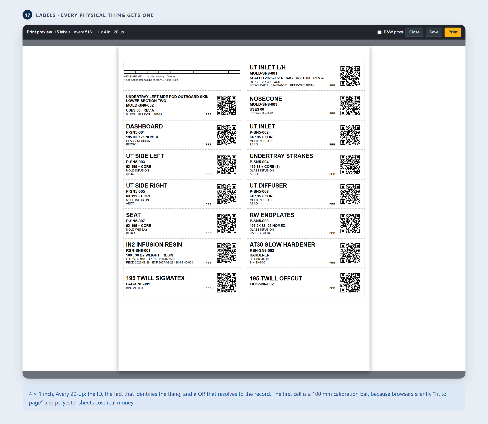

Every physical thing gets a 4 x 1 inch label carrying its ID, its name, the fact
that actually identifies it, and a QR code that resolves to the record. On a
part that fact is the layup stack; on a mold it is the sealing record and the
number of parts pulled off it. The point is that the label answers "what is
this" with the phone still in your pocket, because RFS wifi drops and gloves are
covered in resin. Scanning is the fast path, not the only one.

There is a Label button on a work order and on a part, and a bulk builder under
Reports. The builder lets you pick the stock (Avery 5161, 20 up, or 5522
WeatherProof polyester for chemicals) and the cell to start at, so a part-used
sheet gets finished instead of binned. It also prints a 100 mm calibration bar:
browsers silently apply "Fit to page" scaling, and ten seconds with a steel rule
is cheaper than a wasted sheet of polyester.

Coupon labels are text-only. A coupon ID is one character too long for the QR
budget, and 12 mm tape could not hold a code anyway.

## Scanning

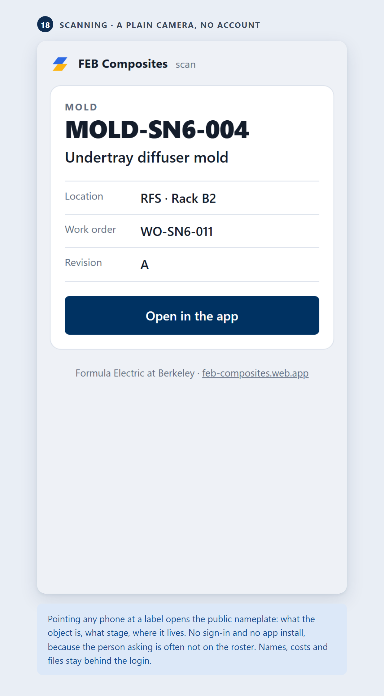

Scanning a label with a plain phone camera opens a public nameplate that works
**with no account and no signal**. It paints immediately from the ID in the URL;
if the lookup succeeds it adds the name, stage, location and work order; if it
does not, it says so plainly rather than spinning forever. There is an "Open in
the app" button.

Working without an account is the point. A Jacobs staffer needs to know whose
mold is blocking the container, and adding them to the roster to answer that is
absurd.

That page cannot read the real records. It reads a separate mirror carrying nine
whitelisted fields: id, class, name, stage, location, work order, revision, a
note, and a timestamp. Everything on it is already printed on the physical
label, and the rules reject any write carrying anything else, so a bug cannot
publish a layup stack or somebody's email. The mirror keeps itself in step, and
a lead can re-publish everything with **Rebuild scan mirror** under Reports.

**Inside the app**, the topbar has a **Scan** button next to search. Where the
browser supports it (Chrome, Android) it opens the camera; where it does not
(Safari) it offers a typed-code field and says why — the phone's own camera app
reads the code perfectly well and lands on the nameplate anyway. A code resolves
whether it arrives as the full URL, the bare code, lowercase, or with whitespace
round it, because somebody will retype it off a scuffed label.

Every mold, item and lot detail page has **Move** and a stage button that names
its destination ("Sealed", not "Advance"), both outside edit mode. Move offers
the storage records and can take the shelf by scan, so the sequence is: scan the
mold, tap Move, scan the shelf. That makes location a controlled value, which is
what CS-011 §7.3 says it needs to be. Advancing leaves an undo bar.

## Which lots went in

The cure buy-off already asked what resin went in and when. It also asks which
fabric roll, which resin lot and which hardener lot, in the same modal, because
that is already the one moment somebody is standing at the part having just
mixed resin. A second prompt at the same instant is the one people learn to
dismiss.

The fields are **default-and-confirm, not select**: each is pre-filled with the
most recently opened lot of that class, which under CS-011's one-open-container
rule is the one physically on the bench. Right by default about 90% of the time
beats blank 100% of the time, at one tap instead of three scans. There is a scan
button beside each, and a scanned lot is recorded as verified rather than
remembered.

**"I don't know" is a valid answer.** This is the load-bearing decision. A gate
that can only be satisfied by naming a lot gets satisfied by naming the wrong
one: with two jugs on the bench at 11pm, someone scans the nearest, and the
record is then precise, confident and wrong. An honest gap is worth more. The
lots print on the traveler too, unflattering source and all.

## Getting around

**Back goes back.** Records cross-link constantly, and Back returns one step
along the trail you actually took, across tabs, saying which record it is
returning to: open a ticket from a part and Back says the part. Picking a tab
from the sidebar ends the trail, since that is "take me elsewhere" rather than a
step.

**Cross-links are everywhere.** Click a chip to jump to the related record. A
part's layup stack and its linked work order's stack stay in sync, so edit
either one. Every record has a deep link you can paste to somebody.

**⌘K (Ctrl-K)** anywhere is global search. The bell collects @mentions, typed as
`@name` in a project comment, along with project assignments, and shows an
unread count. That is in-app only; there is no email.

**Light and dark.** It follows your system setting on first load and you can
flip it with the sun/moon button in the header (the ⋯ menu on a phone); the
choice is remembered. Printing always comes out black-on-white regardless.

**Phones and tablets.** The blue sidebar folds into a slide-in drawer behind the
☰ button, and at that width the account and lead actions (Backup, Restore,
Roster, Sign out) move into a ⋯ menu next to search and the bell. The wide list
tables turn into one card per row.

## How access works

Anyone can create an account at the login page, but a new account can't see or
touch anything until a lead adds their email to the roster using the Roster
button in the header. This is enforced server-side by `../firestore.rules`, not
just by hidden buttons.

There are two roles. A `member` does all day-to-day work across every tab. A
`lead` can also delete records, restore from a backup file, load the SN5 archive
and manage the roster.

When someone leaves the team, remove them from the roster. Their account keeps
existing but stops working.

Firebase Auth handles passwords, including hashing and reset emails. We never
see or store them, and "Forgot password" on the login page works on its own.

## What a buy-off is, and isn't

A work-order buy-off records who was signed in when the button was clicked:
name, email and timestamp, and since August 2026 it also records *what*. Steps
carry a rule saying what has to exist before they can be signed: a layup stack
before the stack can be frozen, the CAD attached or linked before a mold design
review, a written note on the machining and drop-test steps. Press Buy off
without it and the app says what is missing and gives you the button that fixes
it. A lead can sign anyway, and it costs a sentence that lands in the event log
next to what was missing — the same bargain as overriding a cure hold, and for
the same reason: a gate nobody can pass gets worked around outside the app,
which is worse, because then it isn't written down anywhere.

A photo is suggested and never required, on the steps that need a note. Half
these steps happen in a dark corner of RFS at eleven at night, and a hard photo
requirement is how you teach people to write the traveler up the next morning
from memory instead.

On the Parts tab, one stage value is gated the same way: setting CAD to "Mold
CAD/CAM Done" wants the mold CAD linked from Drive or attached as a PDF. That
one is a claim about a file, and a file either exists or it doesn't. The other
stages are claims about a physical object anyone in the shop can walk over and
check, so they stay one click with an undo bar.

Native CAD uploads to the Files section on a ticket, a work order or a part:
STEP, STP, SLDPRT, SLDASM, IGES, X_T, 3MF, F3D, DXF, DWG and STL, up to 50 MB
(everything else stays at 10 MB). A linked Drive document still satisfies every
check that wants "the CAD", and usually it's the better answer: a STEP file in
the app is a copy, while the Drive link is the thing everyone else can open and
edit.

All of that is much better than typed initials, but be honest about the limits,
and the same applies to every record in every tab. Nothing here is tamper-proof.
Any roster member can edit any record, and there's no version history inside the
app, so the monthly backup files in Drive are the audit trail.

Two mitigations are built in. Edits save per-field, so someone editing a BOM
can't clobber a buy-off saved at the same moment; the remaining race is two
people editing the same field of the same record at once, which is
last-write-wins. And "Reset steps", the one button that erases buy-offs
wholesale, is lead-only and warns before firing.

If a record ever looks wrong, that's a conversation, not a software bug.
Composites is a dozen-ish people who see each other twice a week.

The rules do genuinely enforce roster membership for everything, lead-only
deletes, lead-only roster changes, roster self-edits limited to avatar and name
so you can't promote yourself, and increment-only id counters.

## Files, photos, and watchers

Uploads (avatars, project files, comment images) live in Firebase Storage, which
requires the project to be on the Blaze plan. We set a Cloud Billing budget cap
so it can't surprise-bill, and real usage is a rounding error against the free
tier. Images are downscaled in the browser before upload, so a phone photo lands
at around 150 KB instead of 4 MB.

Comment rich text is sanitized before it's stored and again before it's shown,
so pasted scripts and handlers can't run for other viewers.

Descriptions are comments that happen to always be there, so they use the same
editor: click the text and write, no Edit button and no form. That covers a
ticket's description, an issue's What happened, a work order's notes, the part
note and a purchase's notes. All of them take photos, tables and pasted Google
Docs.

Clicking a photo opens it full screen without leaving the app. The arrows walk
every photo on that record (the Files grid and the comment thread as one set),
and the download button saves it with its real filename. Swipe works too.

Watcher "new activity" is per-browser. It's tracked in your browser's local
storage, so the unread dot reflects when you last opened this on *this* device.
It isn't synced across devices and it isn't an email.

## One-time project setup

Already done for `feb-composites`. These steps are here for the next person who
has to stand it up again or move it to a team account, and take about 20
minutes.

Use a team Google account if at all possible, or add the next lead as an owner
the day you set it up. The failure mode to avoid is the Firebase project living
in a graduated senior's personal account.

1. At [console.firebase.google.com](https://console.firebase.google.com), Add
   project. Skip Analytics.
2. Build, then Authentication, Get started, Sign-in method, enable
   Email/Password.
3. Build, then Firestore Database, Create database, production mode, region
   `us-west1` or whatever's closest.
3b. Upgrade to the Blaze plan, needed for file and photo uploads: console, gear
   icon, Usage and billing, Modify plan, Blaze, add a card. Then cap it at
   [console.cloud.google.com](https://console.cloud.google.com), Billing,
   Budgets & alerts, Create budget of $1 to $5 with alerts at 50/90/100%. Then
   Build, Storage, Get started with the default rules, which `firebase deploy`
   overwrites with `storage.rules`.
3c. Give the bucket a CORS rule, once, from `03 App/`:

   ```
   gcloud storage buckets update gs://feb-composites.firebasestorage.app --cors-file=cors.json
   ```

   **`firebase deploy` does not do this.** It pushes hosting and rules, and CORS
   is bucket configuration, so a deploy alone will not fix it. Without the rule
   the Molds tab's 3D plan view shows the stock blocks with no mold inside them.
   If you see blocks and no mold, the viewer says so underneath itself; that
   message is the one to act on.
4. Project settings, Your apps, the `</>` web option, register an app, then copy
   the config values into `firebase-config.js` here, replacing the demo values.
   Watch the variable name: the console hands you `const firebaseConfig = {…}`,
   but this app reads `window.FIREBASE_CONFIG`, so the line must start with
   `window.FIREBASE_CONFIG =`. If you see a "Not configured" screen, that's what
   happened. These values aren't secrets; the rules are the security.
5. On your laptop, `npm install -g firebase-tools`, then `firebase login`.
6. In `../`, the folder with `firebase.json`, set the project id in `.firebaserc`
   and run `firebase deploy`. That pushes both the rules and the site, to
   `https://<project-id>.web.app`.
7. Bootstrap the first lead. The roster starts empty and only leads can edit it,
   so it's chicken and egg: open the app, create your account, then in the
   Firebase console go to Firestore, Start collection, id `roster`, doc id set to
   your email exactly as you signed up in lowercase, with fields `name` (string)
   and `role` (string) set to `lead`. Hit "Check again" in the app.
8. Load SN5 archive from the header to bring in the retro work orders, parts and
   last season's timeline. Add the rest of the team to the roster and drop the
   link in #composites.

## Day-to-day

Nothing to run. Edits save automatically and show up live for everyone. If the
shop wifi drops, keep working, because writes queue locally and sync when it's
back. Two habits are worth keeping.

Back up monthly, using Backup in the header, into the team Drive. Firestore is
reliable, but a plain JSON file in Drive is the backup nobody can lock us out
of. Restore, which is lead-only, reads that file back.

Clean up the roster at handoff. The incoming lead gets `lead`, departed members
come off the list, and the new lead gets added as a project owner in the
Firebase console under Project settings, Users and permissions.

## Cost

On Blaze but effectively free. Firestore gives 50k reads and 20k writes per day
with 1 GB stored, and Storage gives 5 GB plus 1 GB/day egress. A heavy build day
is a few thousand reads, a few hundred writes, and a handful of photos. The
budget cap from setup step 3b is the safety net. The card is only there because
Storage requires it, and nothing here approaches paid usage.

## Working on the code

Everything runs offline against the Firebase emulators:

```
cd "03 App"
firebase emulators:start --project demo-feb-work-orders
# app on http://localhost:5050, emulator UI on http://localhost:4000
```

The values in `firebase-config.js` auto-route to the emulators on localhost, so
you develop without touching production data. Emulator accounts and data are
throwaway. Create the bootstrap roster doc in the emulator UI's Firestore tab,
the same as step 7 above.

The test suites, the screenshot tools and what each one is for are in
`tools/README.md`. The decisions behind the app — why the folds are not
`<details>`, why routing never calls `pushState`, what the file map is, and the
rules for anything that touches a screen edge — are in `DESIGN-NOTES.md`. Read
that one before changing behaviour this file describes.
