# FEB Composites, hosted app

Live at https://feb-composites.web.app. It's a tabbed workspace for everything
composites tracks over a season, not just work orders. Everyone signs in with
email and password, and the Firestore database is shared, updating live for the
whole team. Set your photo by clicking your avatar at top right.

This file is the app's manual. In order: [the tabs](#the-tabs), then
[labels](#labels) and [scanning](#scanning), [how access
works](#how-access-works), [what a buy-off is](#what-a-buy-off-is-and-isnt),
[files and photos](#files-photos-and-watchers), [project
setup](#one-time-project-setup) for standing the Firebase project up again,
[day-to-day care](#day-to-day), [cost](#cost), [local development and
testing](#local-development-and-testing), and the [file
map](#files). If you are here to run it locally, jump straight to local
development; if you are the next lead, read `../../HANDOFF.md` first.

The screenshots through this file regenerate with
`node tools/make_mockups.mjs`, so if one looks stale, rerun that.

## The tabs

### Dashboard


The landing page is the board. It shares the app's ordinary white-card
surfaces (Simon's call: the mission-control layout, not the navy panel it
briefly shipped as), and reads as a status board through structure instead:
a dense module grid, the alert strip's bare Saira numerals, and the
sidebar's gold speed slash on every module header. Read-only; every element
links into the tab it came from; on a phone the grid re-declares its areas
into a today-first stack with no second render path. The grid class is
`.dboard`, because `.board` belongs to the Tickets kanban.

The **alert strip** leads with the lead's one-second read, team-wide
regardless of the list toggle below: late, blocked, unassigned (open work
with no owner), curing with the soonest ready-at clock, and T-minus to the
competition. All quiet renders a green all-clear cell. The modules under
it: **the work list** is one grouped deadline list, an item in exactly one
bucket, with a part and its work order merged into one row (the SN5 archive
proved the double-counting overstated "behind" by about 40%); Late and This
week render open, the quieter buckets fold. **Shop status** merges what is
blocked, what is curing (a clock time, never a countdown), and the
Inventory warnings into one severity-dotted list; a clean shop reads a
single "All clear" line. **Season** is the stage bars plus the molds
pipeline, counts printed as words for colourblind safety. **This week at
RFS** lists only the booked stations. **Activity** is a cross-app feed
built from the `updatedAt`/`updatedBy` every record already carried plus
comments and step buy-offs, one event per record per day, with watched
tickets that changed pinned on top. **Countdown** holds T-minus, the next
milestone, and three all-season counters (days since a missed deadline,
layups banked, sign-offs); a lead sets the season (name, date, milestones)
in one modal writing `config/season`, readable by the roster and writable
by leads only. **Money** is the unreimbursed sum plus the $50 approval
rule. **Launchpad** is filtered jumps (my tickets, late WOs, the reorder
list, the week plan), the datasheet and standards shelves with live counts,
and the pinned Google links. **Shop knowledge** rotates a fact a day, most
of them mined from the team's own SN5 documentation, deterministic so the
whole team sees the same one; on the configured competition date the board
wears gold and the module tells you to go run the car.

Empty states shrink the page instead of padding it, and nothing that
renders empty on the team's own archive sits above the fold.

### How parts, runs and molds fit together

The part is the parent record. It is the thing the car needs, and it outlives
every attempt at making it. Everything else hangs off it:

```
Part ─┬─ Work orders   one RUN each at making it (a remake is a second run)
      ├─ Mold ── Mold file ── Drawings
      ├─ Tickets
      └─ Scheduled weeks
```

Every record in that chain shows the same lineage bar across the top, so you
can walk up to the part or down to the drawings from wherever you are.

The link that matters is **`wo.partId`**: the child names its parent, which is
the only direction that cannot go ambiguous. `part.workOrderId` still exists but
means "the current run", not "the link". Older records join by part name
instead, and the app says so: a run matched that way is labelled *matched by
name* with a **Confirm** button that writes the real link. None of the 33 SN5
parts carried an id link, so most of the existing data starts out matched by
name and gets promoted one part at a time as people open things.

Two parts sharing a name is the one case that still refuses to guess, because
there is no way to know whose run an unlabelled work order was. Duplicate part
names are a real pattern here, so this matters.

**+ New run** on a part starts another work order against it, carrying the
part's name, subteam, deadline, mass target, process and layup plan.

The mold works the same way: `p.mold` is the committed link, and until somebody
sets it the mold is derived through the part's runs and shown as *via WO-…*. Set
it once and the mold's own "used by" list and the QR label pick it up. A part's
`moldProgress` and the mold record's `stage` are deliberately **not** synced;
they are different enums maintained by different people, so the app points out
when they disagree rather than quietly overwriting one.

### Work Orders

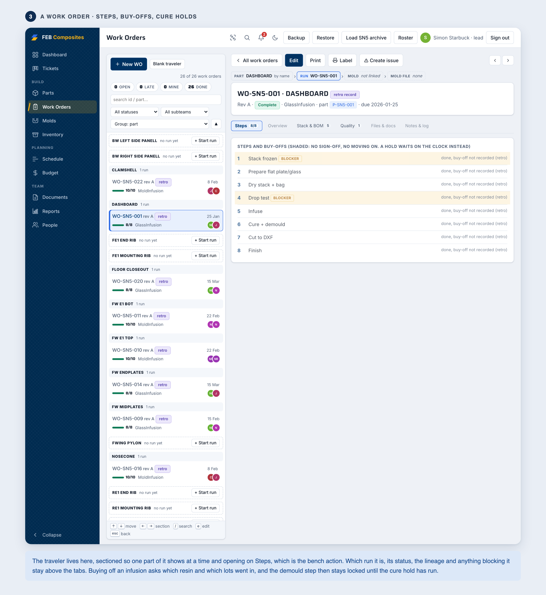

Work Orders is the manufacturing traveler: layup stack, BOM, step buy-offs
stamped with who signed them, blocker enforcement, enforced cure holds, and a
printable hand-fillable sheet that is always exactly two pages. The hold
numbers ship in `resins.js`, each signed off by a lead, and a lead can now
override one from the app: the "Why N hours?" modal carries a "Change this
hold" button writing a per-resin override to `config/resins`. Only the hold
and its sign-off can move; the datasheet floor stays in code, and an
override below it is refused at write time and ignored at read time, so
nothing can weaken a hold from either side.

It is a split view, like Parts and Molds. The rail indexes every run grouped by
the part it builds, so the tab reads as the hierarchy above; each row shows how
far through its buy-offs the run is and whether it is blocked or curing. Runs
whose part cannot be resolved collect in a named block at the bottom, which on
the SN5 archive is most of them and is the to-do list for linking them up.
Parts nobody has started appear too, with the button that starts a run. Group,
sort and filter are yours to set.

The pane is one scroll, ordered Steps, Details, Stack & BOM, Photos, Quality,
Files & docs, Notes & log. Steps leads because that is what you came to do. A
bar above it jumps to any section (`1`-`7` from the keyboard) and carries a
count per section and a dot when something in one wants attention, so you can
see there are five plies or that a check failed without scrolling to find out.
It is buttons rather than anchors on purpose: an `href="#wo-stack"` would
overwrite the deep link the app keeps in the URL hash.

Every section header is also a fold. Steps and Stack & BOM open by default
(you read the stack while signing "Stack frozen"); the reference sections
(Details, Photos, Files, Notes & log) start closed, a warned section never
starts closed, and edit mode opens everything. Folds keep their state while
you stay on the record — a buy-off no longer snaps them all back — and reset
when you switch to another one. Notes & log opens itself with a gold "new"
dot when somebody wrote a note since you last looked; gold means new, amber
means trouble, and the two dots never trade jobs. Folding is a class on the
card, not a `<details>`, because a closed `details` skips painting and folded
sections would silently vanish from a browser print; the print stylesheet
force-shows every section body instead.

The steps themselves read as a traveler spine: a hairline runs down the
number column and each step's number is a circular node on it — green ✓
walked, the one gold node is the step to act on NOW, an amber ring is a
blocker, slate ◷ waits on a cure clock, red ✗ failed, and an outline node on
a dashed spine has not been walked yet. Four or more consecutive signed
steps compress into one counted line ("Steps 1–8 · 8 done · 9 photos") with
the full rows one tap inside, so a half-signed record reads solid green,
one gold node, then dashed, from across the bench.

What is true of the whole record stays above that bar: which run it is, its
status, the lineage bar, and anything blocking it, including a cure hold, which
is shown there as a clock time rather than a countdown (the step's own banner
is the one a timer keeps honest). Unlike Parts, this rail does not hide
finished runs by default, because reading back what was done is half of what a
traveler is for.

A work order is one run at making a part, so its layup stack is what that run
**actually laid**, while the part's stack is the **plan**. Editing the plan
pushes it to every run that is still following it; editing a run's stack marks
that run as-built and never writes back to the plan. When they differ the run
says how many plies moved, with a side-by-side compare and an explicit *Adopt as
the part's plan*. A run whose "Stack frozen" step is signed is left alone by plan
edits entirely — the bench is working to that piece of paper.

The stack itself is an editable table: change any field in place, insert a ply
above another, duplicate, reorder toward or away from the mold surface, or
delete. P1 is the mold surface and the table says so. Each ply carries a hidden
id so that two people editing the same stack at once merge instead of
overwriting each other; only reordering is last-writer-wins, because two people
reordering the same stack has no correct answer.

Material colour is a swatch beside a short text tag (CF, Spread, Core, Mesh), so
the distinction survives greyscale, a colour-blind reader and the black-and-white
laser. Hue is never the only thing carrying the meaning.

### Parts

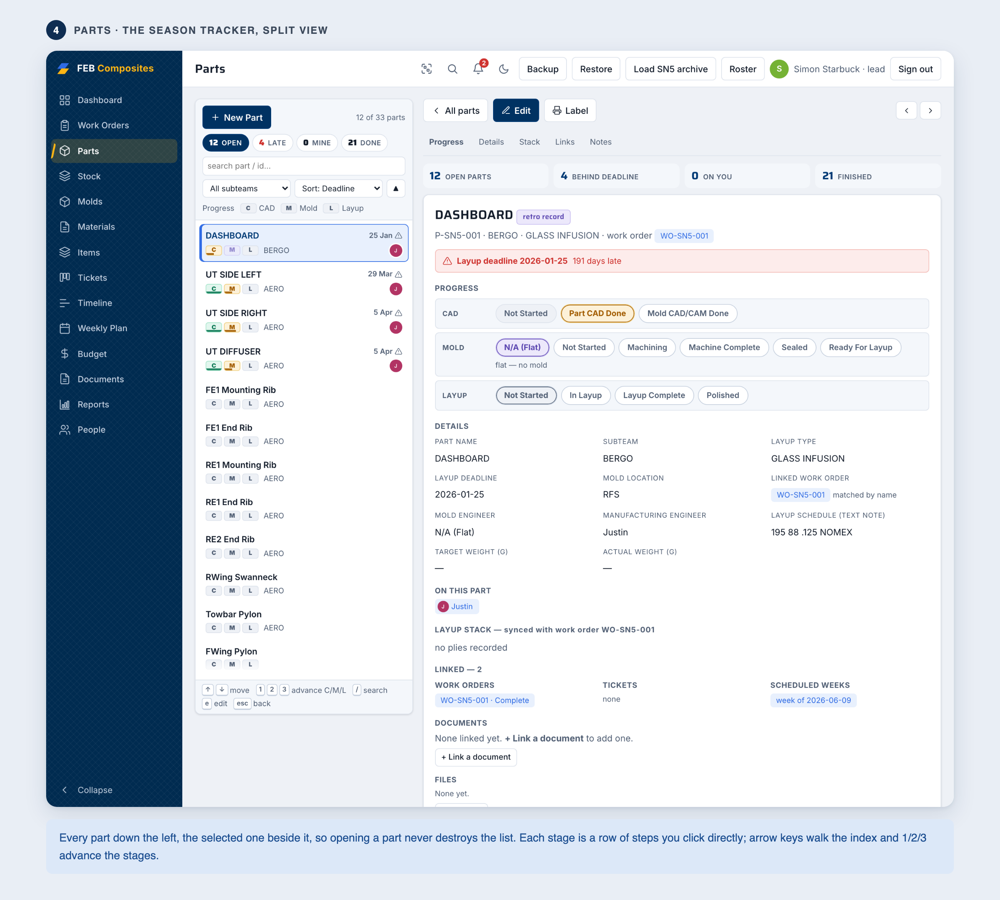

Parts is last season's Part Tracker reborn, and it leads the Build group
because the part is where the work starts. Each part carries three parallel
progress stages (CAD, Mold, Layup) plus subteam, layup type and schedule,
engineers, target weight, and a layup deadline.

The page is built from the same section cards as a work order: a jump bar
with a count per section and a warn dot, Progress, the layup stack and the
runs open by default, and the reference sections (Details, Mold, Links &
files, Notes) folded until asked for — same sticky fold state, same
print-safe class fold. The old anchor jump bar is gone with them; anchors
would have overwritten the record deep link in the URL hash.

Its **Runs** section is the rest of the picture: every run against the part
with status, due date and ply count. The **Mold** section holds the mold and
its **mold file**, with buttons straight to the 3D view and the drawings;
tickets and scheduled weeks live under **Links & files**.

("Mold file" is the stack plan record, `STK-…`: the slicer's output for how the
mold gets cut out of tooling board. The lineage bar and the part page call it
the mold file because those screens already use "the plan" for the *layup*
plan, and two different plans on one screen is confusing. The Molds tab, where
it is shown as a record in its own right, still calls it a stack plan.)
Before this the Parts tab could not reach a mold or a drawing at all.

SN5 parts have no layup plan of their own — the old tracker recorded the layup
against the job, not the part — so a part with no plan shows what its run
actually laid, labelled as borrowed, with one click to adopt it as the plan.

Above 900px it is a split: an index of every part down the left, the selected
part beside it. Opening a part no longer destroys the list and going back no
longer destroys the part, so you can work down your own parts without the page
swapping under you: `↑`/`↓` or `j`/`k` walk the index, `1`/`2`/`3` advance CAD,
Mold and Layup on whatever is open, `/` searches and `esc` clears. With nothing
selected the right pane is the season instead: how the open parts are spread
across the three stages, and who owns what is behind. Below 900px it collapses to
the older shape: the index is the page, tapping opens the part, back returns.

Each stage is a row of its own enum, and you set it by clicking the step you
want. There is no edit mode for progress, because advancing a stage is the thing
people do most and it used to cost five interactions. Moving forward one step
writes immediately and leaves an undo; moving backwards, declaring a part flat,
or skipping steps asks first and names what it would skip; this is a live shared
database, so the surprising directions are the ones that get a confirmation.

A stage that hasn't started reads grey, never amber. That sounds obvious, but it
was wrong for the whole of SN5: `"N/A (Flat)"` occupies slot 0 of the mold enum,
so `"Not Started"` sat at index 1 and coloured itself as in-progress. Progress
colour is derived from what a value *means* now, never from where it sits in an
array.

### Molds

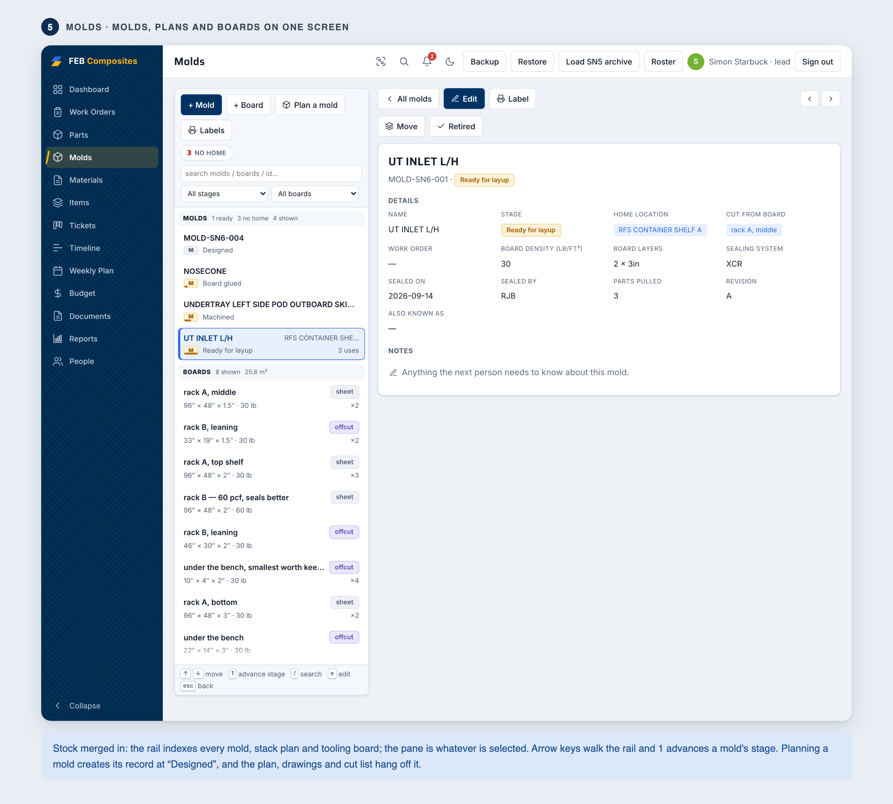

Molds holds the whole physical inventory of mold-making, merged from what
used to be two tabs (Stock and Molds) into one Parts-style split: a
persistent rail of three groups (molds, stack plans, tooling boards) on the
left, the selected record on the right. Arrow keys or j/k walk the rail, `1`
advances the selected mold one named stage with the same undo bar as the
button, `/` searches, esc goes back. On a phone it collapses to
list-then-detail, exactly like Parts.

A **mold** used to exist only as free text inside one work order, so two work
orders using the same mold held two copies of the truth and its location was
wrong the moment anybody moved it. Now it is a record with its own stage,
home location, sealing date and a count of parts pulled off it; the work
orders and parts that used it are a live join, and its stack plan's exploded
view, blanks table, drawings and STL export sit right on it.

A **board** is the raw material: a full 4×8 sheet and an offcut are the same
kind of record, so remnants come back into stock instead of piling up.
Boards have real detail pages now, which is where a scanned BRD- label and
the mold's "Cut from board" chip land.

**Plan a mold** takes an STL (or a typed rectangular block), picks board
thicknesses that waste the least, splits tall molds at the ShopSabre's
cut-depth limit, prints a numbered cut list and a dimensioned engineering
drawing set, shows the mold sitting inside translucent stock in a rotatable
3D view, and exports the planned blocks back out as STL so CAM can use them
as the stock body. Planning also creates the mold record itself, at
"Designed", with the plan linked to it, so the record exists from day one of
design instead of being back-filled after machining. Three sample molds ship
with the app, so the planner can be tried without exporting anything from
Fusion.

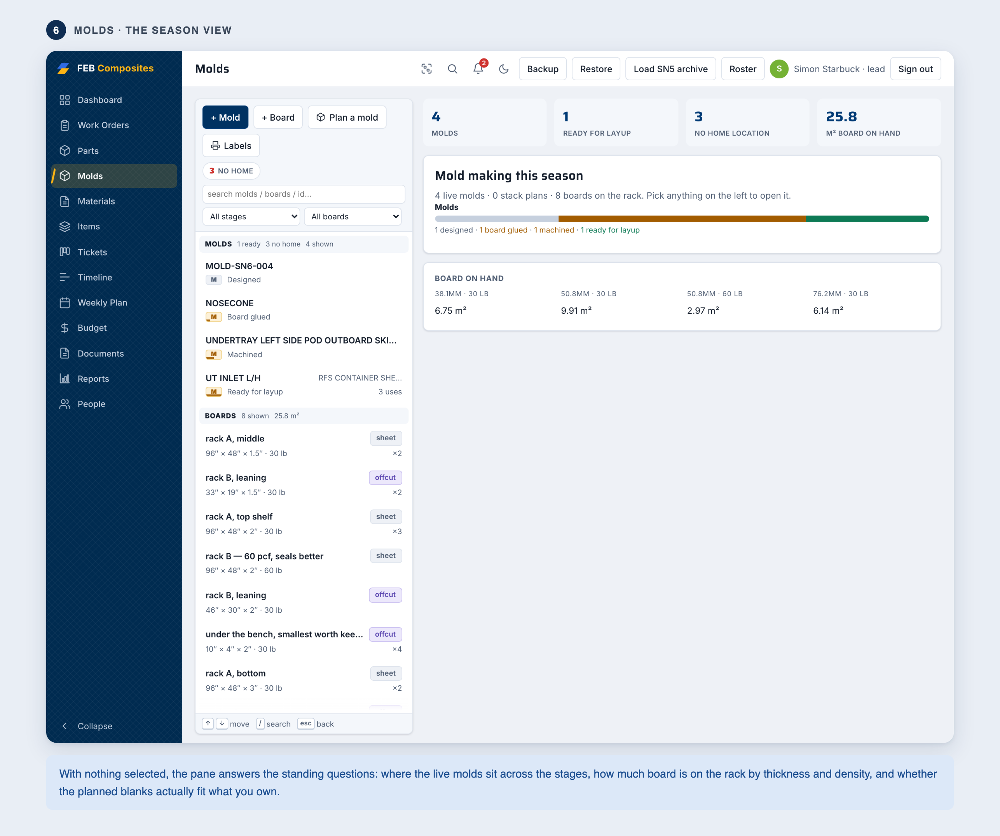

With nothing selected, the right pane is the season: where the live molds
sit across the stages, the board on hand by thickness and density, and
whether the planned blanks actually fit the rack.

### Tickets

Tickets is a jira-style tracker holding two kinds: projects (R&D, process fixes,
outreach, and they can have sub-tickets) and issues (a production
nonconformance, which needs a work order, a disposition and a documented root
cause before it can close). The tab is the same master-detail split as Parts,
Work Orders and Molds: a rail of every ticket on the left, grouped Projects
then Issues with each sub-ticket nested and indented under its parent, and the
open ticket in the pane beside it. With nothing selected the pane is the
kanban board (To Do, In Progress, Collecting Data, On Hold, Done, Cancelled),
and dragging a card between columns still changes its status. There is no
separate list view any more; the rail is the list, with open/late/mine/done
chips, a kind filter, search, and the arrow keys.

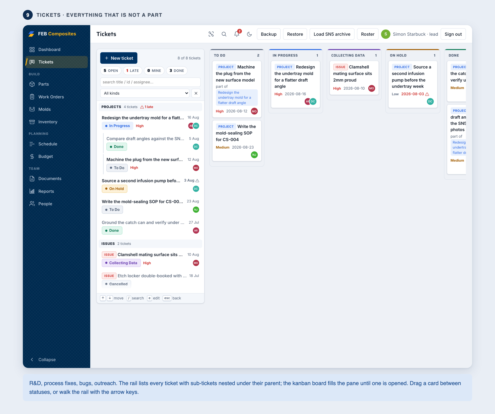

Each ticket's page opens with a lineage bar: a sub-ticket names its parent,
hyperlinked (that is the route to the top ticket from anywhere, including a
deep link), and an issue walks Issue, then its run, then the part the run was
building, ghosting whatever is not linked yet. A jump bar counts what is in
each section (an issue that still cannot close carries a warning dot) and
digits 1-5 scroll to them. Sub-tickets are a real children table with status,
due date, lateness, priority and assignees, and the New sub-ticket modal
starts from the parent: related parts and work orders carry over, the due
date defaults to the parent's and is capped there. The comment thread reads
newest-first with the composer at the top, and on a phone the description and
discussion come before the metadata instead of five screens after it.

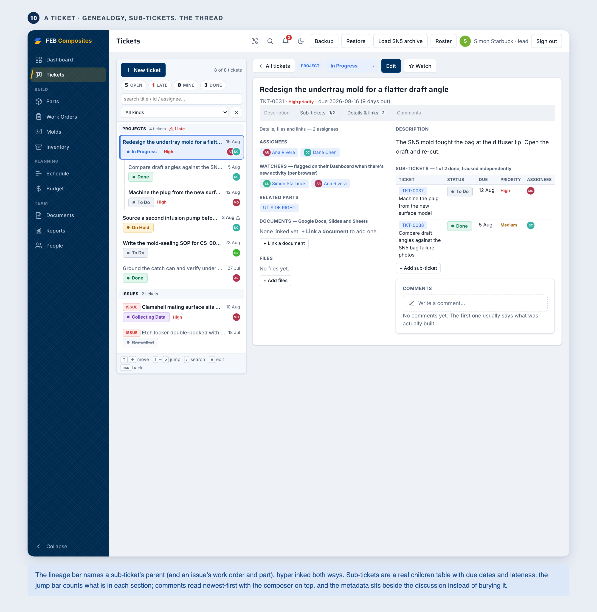

Back goes back. Records cross-link constantly, and following a chip from one
ticket to another used to dump you at the board when you pressed the button,
because it always meant "the list". It now returns one step along the trail you
actually took and says which record it's returning to, across tabs: open a
ticket from a part and Back says the part. Picking a tab from the sidebar ends
the trail, since that's "take me elsewhere" rather than a step.

### Schedule

One tab, two views behind a toggle: the
season by station, and the week by person. They were separate Timeline and
Weekly Plan tabs until 2026-08; they always rendered the same schedule
records, and old links to either still land in the right view.

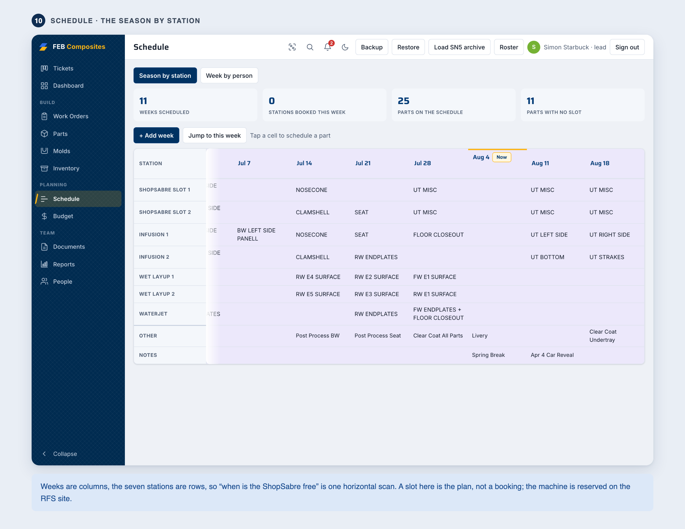

The season view is the production schedule as a station by week grid: stations are the
rows, weeks are the columns, and tapping a cell picks the part that runs at that
station that week. Every write leaves an undo bar, because it changes a schedule
the whole team reads. The current week is called out in gold, and "Jump to this
week" finds it in a long season. On a phone the grid becomes one card per week
listing only what is booked, with finished weeks folded behind a button so this
week is the first thing on screen. Undated weeks from the SN5 import sit in a
collapsed archive below the live schedule rather than at the bottom of it.

The week view is the same schedule cut the other way: one card per day, split
by car group, saying what happens and who is at RFS, plus a per-person weekly
rollup pulled from ticket due dates and manual assignments.

### Budget, People, Documents

Budget runs purchase requests through Submitted, Ordered and Reimbursed, with the
season total, an open-orders subtotal, and a flag on anything over $50.

People is the team roster with photos, roles, and each person's live assignments
across parts, projects and work orders. Leads can set roles.

Documents bundles in every reference doc. The 25 manufacturer datasheets and our
CS standards and pain-points all open as PDFs in-app, with the standards rendered
from markdown by pandoc and the .docx still downloadable, plus the shop
printables. Anyone can upload a doc.

### Inventory

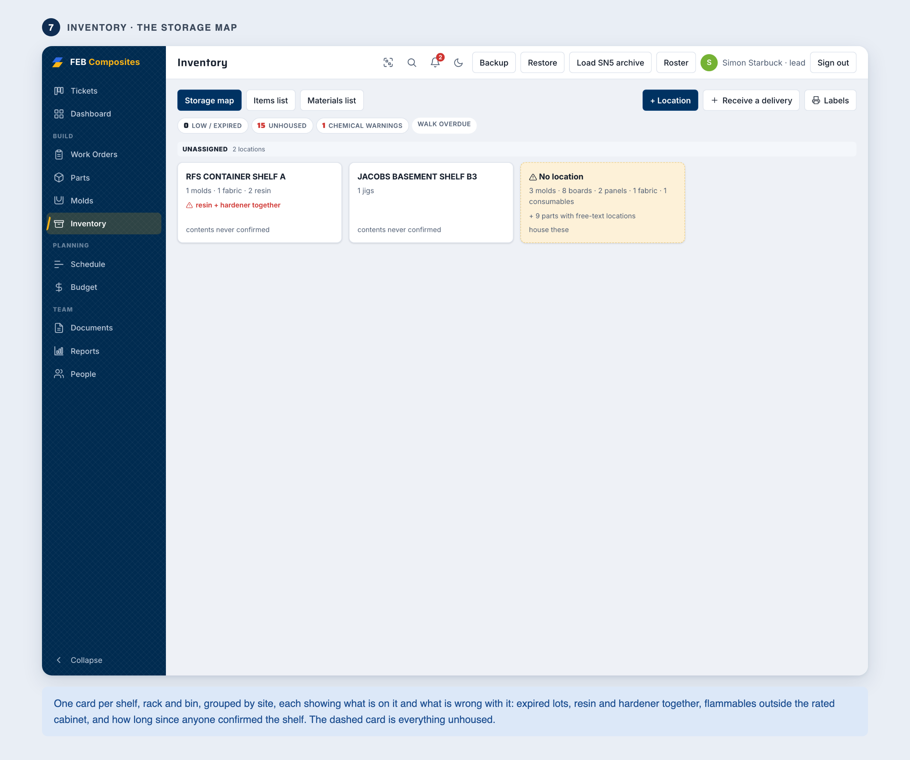

Inventory is the storage map, and it absorbed the Items and Materials tabs.
The default view is one card per storage location (shelf, rack, cabinet,
bin), grouped by CS-011 site, each showing a live summary of its contents
and its problems: expired lots, resin and hardener sharing a shelf, a
flammable lot outside the rated cabinet (§6 as warning chips), things
flagged running low, and how long since anyone confirmed the shelf. A dashed
"No location" card collects everything unhoused, with parts carrying legacy
free-text locations counted honestly.

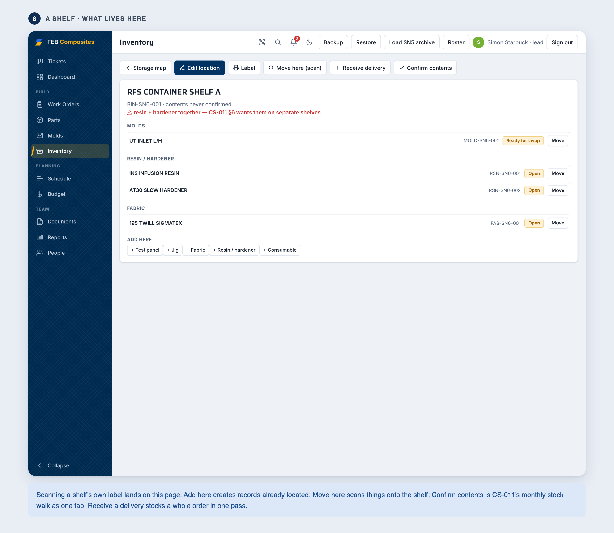

Tap a card, or scan the shelf's own front-edge label, and you are on its
contents page: every mold, board, panel, jig, lot and part that lives there,
each with a Move button. **Add here** creates a record already located.
**Move here** scans the label on each thing you are putting down, the
inverse of the Move flow. **Receive a delivery** stocks a whole order in one
pass (pick the shelf once, one line per thing, batch labels at the end).
**Confirm contents** stamps who walked the shelf and when, which is CS-011
§7.1's monthly stock walk as one tap per location. The Items-list and
Materials-list toggles keep the old flat tables.

The records themselves are unchanged: **materials** are fabric rolls and
offcuts, resin and hardener lots, and consumables, which is what makes
"which roll went into this panel" answerable; **items** are test panels
(stack, coupon range, lot references: the fix for tensile data whose only
identity was a filename), jigs, and the storage locations. All of it runs on
the same schema engine as the mold record (`app/shop.js`).

### Reports

Reports does per-dataset CSV export for parts, work orders, projects and budget,
plus a one-click printable Monday-meeting status board, and it is where you print
labels in bulk. The board is a grid of cards: stage counts colored the way
Parts colors them, and every work order, blocker and deadline a real link
into its record; on paper it prints one section under the next, chrome-free
like every other printout (the app prints with `@page` margin zero so the
browser has no band to write its URL and date into; the margins live inside
the sheets). A lead also gets three one-off migrations there: **Find molds in
work orders** proposes a mold record per distinct free-text mold name and lets a
human untick the duplicates (no algorithm should decide that "MOLD-UT-INLET" and
"UT INLET MOLD" are the same mold); **Link parts to work orders** backfills the
edge that `sn5-parts.json` never had, on exact one-to-one name matches only; and
**Rebuild scan mirror** re-publishes the public nameplates.

## Labels

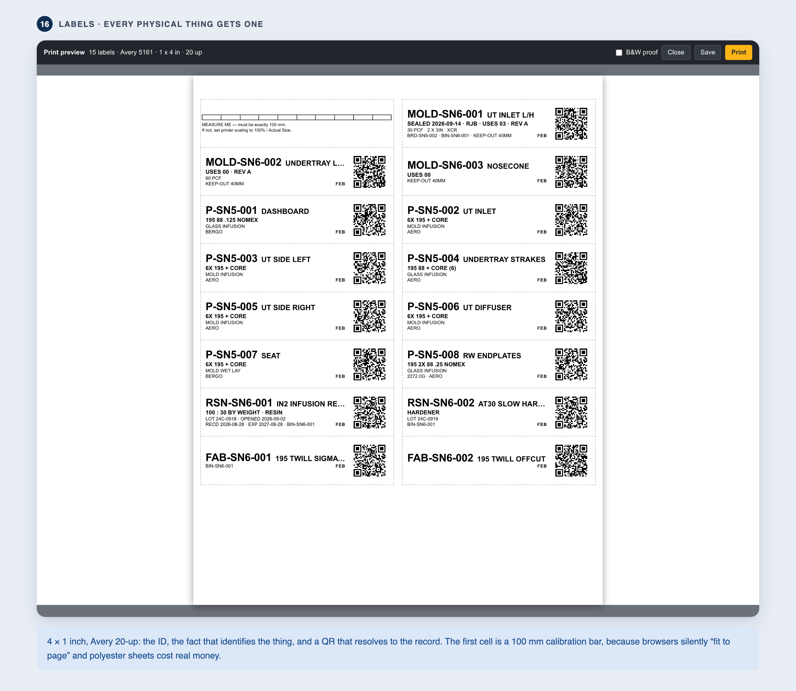

Every physical thing gets a 4 x 1 inch label carrying its ID, its name, the fact
that actually identifies it, and a QR code that resolves to the record. On a part
that fact is the layup stack; on a mold it is the sealing record and the number of
parts pulled off it. The point is that the label answers "what is this" with the
phone still in your pocket, because RFS wifi drops and gloves are covered in
resin. Scanning is the fast path, not the only one.

There is a Label button on a work order and on a part, and a bulk builder under
Reports. The builder lets you pick the stock (Avery 5161, 20 up, or 5522
WeatherProof polyester for chemicals) and the cell to start at, so a part-used
sheet gets finished instead of binned. It also prints a 100 mm calibration bar:
browsers silently apply "Fit to page" scaling, and ten seconds with a steel rule
is cheaper than a wasted sheet of polyester.

The QR encodes `HTTPS://FEB-COMPOSITES.WEB.APP/Q/<ID>`, uppercase and with no
query string or fragment. That is not a style choice. QR alphanumeric mode covers
only `0-9 A-Z space $%*+-./:`, and staying inside it keeps a 45-character URL at
version 3 (29 modules) with error-correction level Q, 25% recovery. One lowercase
letter, one `?utm=`, or a switch to a `#hash` route drops it to byte mode, which
needs version 4 and only gets level M. Nothing about the printed label looks
different; it just scans worse once it has resin on it. `tools/test_qr.mjs`
asserts the module count is exactly 29 so that change cannot land quietly.

The same arithmetic caps an ID at 14 characters (47 - 30 of host - 3 of `/Q/`).
Everything in the grammar fits except a coupon, `PNL-SN6-006-C03` at 15, which is
why coupon labels are text-only: 12 mm tape has 8 mm of print height and cannot
hold even a version 1 code with its quiet zone.

## Scanning

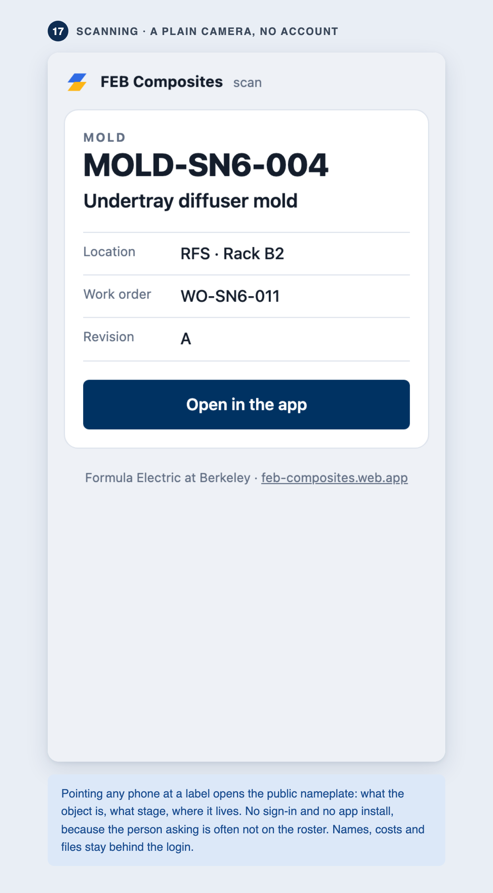

Scanning a label with a plain phone camera goes to `/Q/<ID>`, which Firebase
Hosting rewrites to `q.html`. That page works **with no account and no signal**.
The ID is in the URL, so it paints before any network call (measured at about
16 ms with Firestore hanging); if the lookup succeeds it adds the name, stage,
location and work order; if it does not, it says so plainly after five seconds
rather than spinning forever. There is an "Open in the app" button that deep
links to `/#/<ID>`.

Working without an account is the point. A Jacobs staffer needs to know whose
mold is blocking the container, and adding them to the roster to answer that is
absurd.

**How that is safe.** Firestore rules cannot filter fields (`allow read` is
all-or-nothing per document), so the public page cannot read the real records.
It reads a separate `pub/<ID>` mirror carrying nine whitelisted fields: id,
class, name, stage, location, work order, revision, a note, and a timestamp.
Everything on it is already printed on the physical label. `pubProjection()` in
`labels.js` builds it, and a `hasOnly()` clause in `firestore.rules` rejects any
write carrying anything else, so a bug in the projection cannot publish a layup
stack or somebody's email. `get` is public; `list` stays behind the roster, so
the collection cannot be dumped. `tools/test_pub_rules.mjs` checks all of that
against the emulator, including the regression that matters most: that
`workOrders`, `parts`, `roster` and `budget` are all **still** 403 to an
anonymous caller.

`fb.save()` and `fb.del()` keep the mirror in step. A mirror failure only warns
to the console, deliberately: telling someone their save failed when it did not
is worse than a stale nameplate. And a lead can re-publish everything with
**Rebuild scan mirror** under Reports. That also covers records that predate the
feature and writes that bypass `save()` (`mutateField`, `appendTo`).

## Scanning inside the app, and the two bench actions

The topbar has a **Scan** button next to search. Where the browser exposes
`BarcodeDetector` (Chrome, Android) it opens the camera; where it does not
(Safari) it offers a typed-code field and says why. No scanning library is
vendored: jsQR or zxing would be 200 KB+ to close a gap for a browser whose own
camera app reads the code perfectly well and lands on `q.html` anyway. A code
resolves whether it arrives as the full URL, the bare code, lowercase, or with
whitespace round it, because somebody will retype it off a scuffed label.

Every mold, item and lot detail page has **Move** and a stage button that names
its destination ("Sealed", not "Advance"), both outside edit mode. Move offers
the `BIN` storage records and can take the shelf by scan, so the sequence is:
scan the mold, tap Move, scan the shelf. That makes `location` a controlled
value, which is what CS-011 §7.3 says it needs to be and could not yet enforce.
Advancing leaves an undo **bar**, not a toast, and it is the same bar the Parts
tab uses.

## Which lots went in

The cure buy-off already asked what resin went in and when. It now also asks
which fabric roll, which resin lot and which hardener lot, in the same modal,
because that is already the one moment somebody is standing at the part having
just mixed resin. A second prompt at the same instant is the one people learn to
dismiss.

The fields are **default-and-confirm, not select**: each is pre-filled with the
most recently opened lot of that class, which under CS-011's one-open-container
rule is the one physically on the bench. Right by default about 90% of the time
beats blank 100% of the time, at one tap instead of three scans. There is a scan
button beside each, and a scan sets `lotSource: "scanned"` rather than
`"recalled"`, so a verified lot is distinguishable from a remembered one.

**"I don't know" is a valid answer** and records `lotSource: "unknown"`. This is
the load-bearing decision. A gate that can only be satisfied by naming a lot
gets satisfied by naming the wrong one: with two jugs on the bench at 11pm,
someone scans the nearest, and the record is then precise, confident and wrong.
An honest gap is worth more, and it is the same principle as the
`"not recorded (retro)"` sentinel in the SN5 work orders. The lots print on the
traveler too, `lotSource` included and unflattering.

**Routing.** The app had none before this. Navigation is still the in-memory
`view` object; `syncUrl()` mirrors it into the hash with `replaceState`, never
`pushState`, because `NAV_STACK` is a referrer trail and browser history is
chronological; reconciling them would either make Back lie or break `navBack`.
A pending deep link waits up to six seconds for its record to arrive, because
`fb.state` reaching `"ready"` only means auth is done and the collection
snapshots land afterwards. Giving up early was the first version, and it dumped
every scan into the search box.

Cross-links are everywhere: click a chip to jump to the related record. A part's
layup stack and its linked work order's stack stay in sync, so edit either one.

Press ⌘K (Ctrl-K) anywhere for global search. The bell collects @mentions, typed
as `@name` in a project comment, along with project assignments, and shows an
unread count. That's in-app only; email would be a later Cloud Function.

It has a light and a dark theme. It follows your system setting on first load and
you can flip it with the sun/moon button in the header (the ⋯ menu on a phone);
the choice is remembered. The look is FEB's own: the blue-and-gold speed-slash
mark, a navy sidebar, crisp line icons throughout, and the Saira display face on
headings. Printing always comes out black-on-white regardless of theme.

It works on phones and tablets. The blue sidebar folds into a slide-in drawer
behind the ☰ button, and at that same width the account and lead actions (Backup,
Restore, Roster, Sign out) move into a ⋯ menu next to search and the bell. The
wide list tables (work orders, parts, budget, tickets) turn into one card per
row with labeled fields, so nothing runs off the edge; narrow detail tables
scroll sideways instead, and the timeline becomes one card per week. The tickets
board stacks its six status columns into full-width sections. Form controls render at 16px so iOS doesn't zoom on focus, and every
control grows to a 40px tap target on a touch screen, checkboxes to 24px in a
44px row.

On a wide screen the content runs to 1600px rather than the 1180px it used to,
which on a 1920 monitor was leaving 27% of the window empty on every tab. Past
1500px the card grids add a column instead of stretching the ones they have,
and the Parts index rail grows with the window up to 420px. It is still a cap
and not the full width: past about 1600 a table row gets long enough that the
eye loses which row it is reading.

The Collapse button at the bottom of the sidebar shrinks it to a 56px icon
rail, remembered across sessions like the theme and applied before first paint
so it never snaps shut a moment after load. It is worth the most on a laptop,
where it hands 160px straight to the content (1224px to 1384px at 1440); on a
1920 monitor the 1600px cap is already binding so the gain is smaller. The
navy, the carbon crosshatch and the gold speed slash all survive the collapse,
because the point is to make the sidebar smaller rather than to hide it. The
button does not appear below 900px, where the sidebar is a drawer and there is
no space to reclaim.

The old single-file `../work-orders.html` stays as the offline backup and archive
viewer, since it still opens any exported JSON anywhere, forever. Don't delete
it.

## How access works

Anyone can create an account at the login page, but a new account can't see or
touch anything until a lead adds their email to the roster using the Roster
button in the header. This is enforced server-side by `../firestore.rules`, not
just by hidden buttons.

There are two roles. A `member` does all day-to-day work across every tab. A
`lead` can also delete records, restore from a backup file, load the SN5 archive
and manage the roster.

When someone leaves the team, remove them from the roster. Their account keeps
existing but stops working.

Firebase Auth handles passwords, including hashing and reset emails. We never see
or store them, and "Forgot password" on the login page works on its own.

## What a buy-off is, and isn't

A work-order buy-off records who was signed in when the button was clicked: name,
email and timestamp, and since August 2026 it also records *what*. Steps carry a
`needs` rule saying what has to exist before they can be signed: a layup stack
before the stack can be frozen, the CAD attached or linked before a mold design
review, a written note on the machining and drop-test steps. Press Buy off
without it and the app says what is missing and gives you the button that fixes
it. A lead can sign anyway, and it costs a sentence that lands in the event log
next to what was missing, the same bargain as overriding a cure hold, and for
the same reason: a gate nobody can pass gets worked around outside the app,
which is worse, because then it isn't written down anywhere.

A photo is suggested and never required, on the steps that need a note. Half
these steps happen in a dark corner of RFS at eleven at night, and a hard photo
requirement is how you teach people to write the traveler up the next morning
from memory instead.

On the Parts tab, one stage value is gated the same way: setting CAD to "Mold
CAD/CAM Done" wants the mold CAD linked from Drive or attached as a PDF, on the
part or on its work order. That one is a claim about a file, and a file either
exists or it doesn't. The other stages are claims about a physical object anyone
in the shop can walk over and check, so they stay one click with an undo bar.
Overriding it costs a sentence, which lands in the part's own notes.

Native CAD uploads to the Files section on a ticket, a work order or a part:
STEP, STP, SLDPRT, SLDASM, IGES, X_T, 3MF, F3D, DXF, DWG and STL, up to 50 MB
(everything else stays at 10 MB). `storage.rules` checks the *extension* as well
as the content type, because a browser has no MIME type for a `.SLDPRT`; it
arrives as `application/octet-stream`, and allowing that on its own would allow
any binary under any name. The type is still checked, and that's the actual
security condition: nothing writable here can be served as something the
browser will render, which is what would turn an upload into stored XSS against
the whole team.

A linked Drive document still satisfies every check that wants "the CAD", and
usually it's the better answer: a STEP file in the app is a copy, while the
Drive link is the thing everyone else can open and edit.

That's much better than typed initials, but be honest about
the limits, and the same applies to every record in every tab. Nothing here is
tamper-proof. Any roster member can edit any record, and there's no version
history inside the app, so the monthly backup files in Drive are the audit trail.

Two mitigations are built in. Edits save per-field, so someone editing a BOM
can't clobber a buy-off saved at the same moment; the remaining race is two
people editing the same field of the same record at once, which is
last-write-wins. And "Reset steps", the one button that erases buy-offs
wholesale, is lead-only in the UI and warns before firing. That one is a UI
restriction rather than a server rule, since the field itself stays writable by
any member, the same category as Restore and Load archive.

If a record ever looks wrong, that's a conversation, not a software bug.
Composites is a dozen-ish people who see each other twice a week.

The rules do genuinely enforce roster membership for everything, lead-only
deletes, lead-only roster changes, roster self-edits limited to avatar and name
so you can't promote yourself, and increment-only id counters.

## Files, photos, and watchers

Uploads (avatars, project files, comment images) live in Firebase Storage, which
requires the project to be on the Blaze plan. Google changed Storage's rules in
February 2026 and now a card is required even to use the free allowance. We set a
Cloud Billing budget cap so it can't surprise-bill, and real usage is a rounding
error against the free tier. Images are downscaled in the browser before upload,
so a phone photo lands at around 150 KB instead of 4 MB.

Comment rich text is sanitized with DOMPurify before it's stored and again before
it's shown, so pasted scripts and handlers can't run for other viewers.

Descriptions are comments that happen to always be there, so they use the same
editor: click the text and write, no Edit button and no form. That covers a
ticket's description, an issue's What happened, a work order's notes, the part
note and a purchase's notes. All of them take photos, tables and pasted Google
Docs, and the four that something else still reads as plain text (the printed
traveler prints a work order's notes; an issue can't close with an empty root
cause) keep a plain copy in step with the markup.

Clicking a photo opens it full screen without leaving the app. The arrows walk
every photo on that record (the Files grid and the comment thread as one set),
and the download button saves it with its real filename. Swipe works too, on the
steps where it isn't being confused with panning a photo you've pinched into.

Watcher "new activity" is per-browser. It's tracked in your browser's local
storage, so the unread dot reflects when you last opened this on *this* device.
It isn't synced across devices and it isn't an email. Real email notifications
are a possible follow-on now that Storage put us on Blaze, via a Cloud Function,
but they aren't built.

## One-time project setup

Already done for `feb-composites`. These steps are here for the next person who
has to stand it up again or move it to a team account, and take about 20 minutes.

Use a team Google account if at all possible, or add the next lead as an owner
the day you set it up. The failure mode to avoid is the Firebase project living
in a graduated senior's personal account.

1. At [console.firebase.google.com](https://console.firebase.google.com), Add
   project. Skip Analytics.
2. Build, then Authentication, Get started, Sign-in method, enable
   Email/Password.
3. Build, then Firestore Database, Create database, production mode, region
   `us-west1` or whatever's closest.
3b. Upgrade to the Blaze plan, needed for file and photo uploads: console, gear
   icon, Usage and billing, Modify plan, Blaze, add a card. Then cap it at
   [console.cloud.google.com](https://console.cloud.google.com), Billing,
   Budgets & alerts, Create budget of $1 to $5 with alerts at 50/90/100%. Then
   Build, Storage, Get started with the default rules, which `firebase deploy`
   overwrites with `storage.rules`. The free Storage allowance of 5 GB and 1
   GB/day egress dwarfs our usage, but the budget alert means it can never
   surprise-bill.
3c. Give the bucket a CORS rule, once, from `03 App/`:

   ```
   gcloud storage buckets update gs://feb-composites.firebasestorage.app --cors-file=cors.json
   ```

   **`firebase deploy` does not do this.** It pushes hosting and rules, and CORS
   is bucket configuration, so a deploy alone will not fix it. Without the rule
   the Molds tab's 3D plan view shows the stock blocks with no mold inside them: the
   browser blocks the `fetch()` of the stored mesh before it is even sent.
   Nothing else in the app notices, because every other Storage URL here is used
   by `` or `<a href>`, and those need no CORS at all. If you see blocks
   and no mold, the viewer now says so underneath itself; that message is the
   one to act on.
4. Project settings, Your apps, the `</>` web option, register an app, then copy
   the config values into `firebase-config.js` here, replacing the demo values.
   Watch the variable name: the console hands you `const firebaseConfig = {…}`,
   but this app reads `window.FIREBASE_CONFIG`, so the line must start with
   `window.FIREBASE_CONFIG =`. If you see a "Not configured" screen, that's what
   happened. These values aren't secrets; the rules are the security.
5. On your laptop, `npm install -g firebase-tools`, then `firebase login`.
6. In `../`, the folder with `firebase.json`, set the project id in `.firebaserc`
   and run `firebase deploy`. That pushes both the rules and the site, to
   `https://<project-id>.web.app`.
7. Bootstrap the first lead. The roster starts empty and only leads can edit it,
   so it's chicken and egg: open the app, create your account, then in the
   Firebase console go to Firestore, Start collection, id `roster`, doc id set to
   your email exactly as you signed up in lowercase, with fields `name` (string)
   and `role` (string) set to `lead`. Hit "Check again" in the app.
8. Load SN5 archive from the header to bring in the retro work orders, parts and
   last season's timeline. Add the rest of the team to the roster and drop the
   link in #composites.

## Day-to-day

Nothing to run. Edits save automatically and show up live for everyone. If the
shop wifi drops, keep working, because writes queue locally and sync when it's
back. Two habits are worth keeping.

Back up monthly, using Backup in the header, into the team Drive. Firestore is
reliable, but a plain JSON file in Drive is the backup nobody can lock us out of.
Restore, which is lead-only, reads that file back.

Clean up the roster at handoff. The incoming lead gets `lead`, departed members
come off the list, and the new lead gets added as a project owner in the Firebase
console under Project settings, Users and permissions.

## Cost

On Blaze but effectively free. Firestore gives 50k reads and 20k writes per day
with 1 GB stored, and Storage gives 5 GB plus 1 GB/day egress. A heavy build day
is a few thousand reads, a few hundred writes, and a handful of photos. The
budget cap from setup step 3b is the safety net. The card is only there because
Storage requires it, and nothing here approaches paid usage.

## Local development and testing

Everything runs offline against the Firebase emulators, which need Java 11+ and
`firebase-tools`:

```
cd "03 App"
firebase emulators:start --project demo-feb-work-orders
# app on http://localhost:5050, emulator UI on http://localhost:4000
# (5050 not 5000 because macOS AirPlay squats on 5000)
```

The real values shipped in `firebase-config.js` auto-route to the emulators on
localhost, so you develop without touching production data. Emulator accounts and
data are throwaway. Create the bootstrap roster doc in the emulator UI's
Firestore tab, the same as step 7 above.

Tests, from `SN6 Resources/`:

```
node tools/test_app.mjs           # app logic across all tabs (DOM stub + fake backend)
node tools/test_designsystem.mjs  # app CSS vs 06 Design System, no browser
node tools/test_appui.mjs         # layout on every tab x 4 widths x 2 themes
node tools/test_safearea.mjs      # notch / Dynamic Island / home indicator
node tools/test_qr.mjs            # QR version/ECC arithmetic + the public projection
node tools/test_labels.mjs        # the label sheet, measured and rasterised
node tools/test_route.mjs         # deep links, incl. a link arriving before the data
node tools/test_q_landing.mjs     # the public scan page, offline and leak-checked
node tools/test_scan.mjs          # in-app scanning, move/advance, lot capture
node tools/shoot_ui.mjs --out .ui-shots --tab all   # PNGs of every tab
node tools/shoot_ui.mjs --out .ui-shots --inset portrait   # ...with a simulated island
cd "03 App" && firebase emulators:exec --only firestore \
  --project demo-feb-work-orders "node '../tools/test_wo_rules.mjs'"
cd "03 App" && firebase emulators:exec --only firestore \
  --project demo-feb-work-orders "node '../tools/test_pub_rules.mjs'"
```

`test_designsystem.mjs` is the one that keeps this stylesheet honest. `06 Design
System/` was extracted from it rather than imported by it, so there are two
copies of the same design and nothing but this test holding them together. It
compares every token in all three theme blocks and the look of every shared
component rule, and it fails on a hardcoded value that a token already spells.
It also checks the CSS parses, which sounds pointless until an unterminated
comment silently eats the next rule and the fix you just made does nothing.

`test_appui.mjs` measures what a screenshot can only show: nothing runs off the
side, no tap target is under 40px where there is a thumb, no text drops below
11px, nothing sticky hides behind the topbar, every surface actually changes
colour between light and dark, and `main` is using the window it was given.
Hundreds of checks, because every tab at four widths in two themes is the only way a
check on Parts also covers Weekly Plan.

`shoot_ui.mjs` is a camera, not a test: it asserts nothing. It boots the real
app with `fb.js` stubbed at the route, the SN5 archives seeded and
`tools/lib/fixtures.mjs` filling in the four collections that have no archive,
then writes `<label>-<state>-<width>-<theme>.png` at 1920, 1440, 900 and 393 in
both themes. `--tab all` sweeps every tab, list state only; naming one tab
gives you list, list-with-completed, detail and detail-in-edit for it. It
resolves the app relative to itself rather than the cwd, so running it inside a
git worktree photographs that worktree, which is how four competing Parts
designs were shot under identical conditions and compared frame for frame.

Without `tools/lib/fixtures.mjs` half the tabs photograph as empty
states, because `loadArchive()` only seeds work orders, parts, schedule and
stock. An empty tab is the one state a density audit learns nothing from.

**Two rules for anything new that touches a screen edge**, because the app draws
under the status bar deliberately (`viewport-fit=cover`, standalone PWA,
translucent status bar; that is what lets the topbar meet the Dynamic Island
instead of sitting under a white letterbox):

1. Use the `--sa-t` / `--sa-r` / `--sa-b` / `--sa-l` tokens, never `env()`
   directly. The indirection is what lets `test_safearea.mjs` simulate a phone.
   Insets belong on the base rule, not inside a `max-width` block: a landscape
   Pro Max is 932px, so it takes the desktop rules and still has an island.
2. Anything sticky under the topbar offsets from `--topbar-h`, never a pixel
   count. The topbar's height depends on the top inset, so `top: 62px` is right
   on a laptop and puts the element *behind* the bar on a phone.

Read the images with `.claude/agents/ui-reviewer.md`, a read-only reviewer that
scores a screen 0–5 on eight axes (scan speed, signal-to-ink, colour semantics,
interaction cost, wayfinding, hierarchy, responsive integrity, house fidelity)
and passes only at no-axis-below-3 and average ≥4, the same bar as the `simon`
reviewer in `00 Agent/`. Worth running before any UI change lands: the string
assertions in `test_app.mjs` will happily pass a screen that draws every fact
twice, and did.

The second proves the rules actually enforce access: non-roster users are
rejected, members can CRUD every collection but can't delete or touch the roster,
a member can set their own avatar and name but not their role or someone else's,
leads can, and id counters are increment-only.

If you add a new app file, add it to the `FILES` list in `tools/test_app.mjs` as
well as to `index.html`, or the harness silently won't see it.

`storage.rules` covers avatar owner-scoping, a content-type allowlist and size
cap for project and document uploads, and denies everything else. Its
deny-critical smoke suite is `tools/test_storage_rules.mjs`, run under `firebase
emulators:exec --only auth,storage`, and it proves sign-in is required and that
writes outside the allowed path trees are denied. The allow-path cases gate on
`contentType`, which the emulator's simple-upload REST endpoint doesn't set, so
those run through the app's Firebase SDK, which does set it, and are verified by
hand.

Regenerate bundled data when the sources change:

- `python3 tools/gen_sn5_seeds.py` rebuilds the SN5 parts and timeline seed JSON.
- `node tools/gen_sample_molds.mjs` rebuilds the three sample molds in `samples/`.
- `python3 tools/gen_docs_manifest.py` copies the datasheets, standards and
  printables into `app/docs/` and rebuilds `docs/manifest.json` for the Documents
  tab. Re-run it whenever a datasheet or CS standard changes.

## Files

| File | What |
|---|---|
| `index.html` | Markup and all screen CSS (sidebar, board, modal, avatars, pickers, doc viewer) plus script includes |
| `vendor/purify.min.js` | DOMPurify 3.2.4, self-hosted with an SRI pin. Was a CDN load, which meant rich text silently fell back to plain text whenever the shop wifi dropped |
| `stlio.js` | Writes binary STL and shrinks a mesh to fit storage. Serves both the stock export and the stored viewer mesh; the slicer's own `parseSTL` reads back what it writes |
| `samples/*.stl` | Three sample molds offered in the "Plan a mold" modal, so the planner can be tried without exporting anything from Fusion first. Built by `tools/gen_sample_molds.mjs`; fetched on demand, not at page load |
| `meshview.js` | The rotatable 3D mold-in-stock view. Hand-rolled WebGL, no dependency: pure camera maths tested under node, thin GL glue that only runs in a browser |
| `drawings.js` | The printable engineering drawing set for a stack plan: general isometric, a third-angle three-view, then one dimensioned sheet per layer showing how far in from each edge of the board below it goes. The mold under the blocks is a silhouette traced off the stored STL. Pure string-building, so the whole set is asserted under node |
| `core.js` | Shell: sidebar and topbar, tab router, auth and roster, modal system, avatars, HTML sanitizer, multi-select picker, shared store |
| `workorders.js` `parts.js` `projects.js` `timeline.js` `budget.js` `dashboard.js` `documents.js` | One tab each; they reach Firebase only through core's `save()` and `del()` and `fb.*` |
| `print.js` `print.css` | The printed work-order traveler. Styles are deliberately outside `@media print` so the sheet can be previewed and reviewed on screen |
| `fb.js` | The only file that imports Firebase (auth, per-collection sync, writes, file upload) |
| `firebase-config.js` | Project config, as `window.FIREBASE_CONFIG` |
| `docs/` | Bundled reference docs and the generated `manifest.json` |
| `sn5-work-orders.json` `sn5-parts.json` `sn5-schedule.json` `sn5-stock.json` | Retro SN5 archives, the seeds for "Load SN5 archive". The stock one is the board rack SN5 left behind; the stack planner picks thicknesses from what you own, so on a fresh project it has nothing to plan against until this is loaded |
| `../firestore.rules` | Server-side access control, the actual security |
| `../storage.rules` | File-upload access control |
| `../firebase.json`, `../.firebaserc` | Hosting, rules and emulator config |
